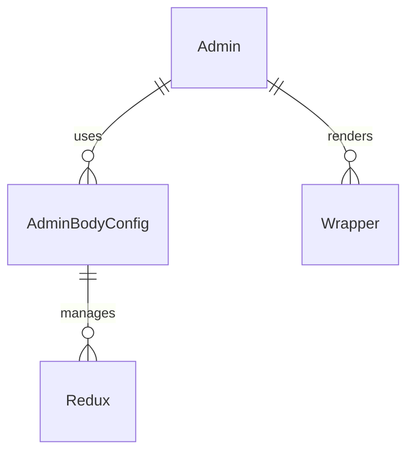

# Admin Component System (`src/components/Admin`)

This folder now implements a **single, unified Admin/Debug UI component**. You only need to import `Admin` and provide a `kind` prop to render any admin/debug UI (session debugger, performance monitor, error logger, debug panel, or custom). All configuration, state, and rendering logic is handled internally.

## Key Concepts

- **Admin.tsx**: The only component you need to import. Accepts a `kind` prop and renders the correct admin/debug UI based on configuration. Handles state, data, and rendering logic for each admin kind.
- **configurations.ts**: Centralizes all configuration types and presets for admin components. Defines the available kinds, default positions, and settings.
- **Admin.module.scss**: All styles for admin/debug components, including themes, positions, and utility classes.
- **index.ts**: Exports only `Admin` and types for easy import elsewhere.

## How It Works

- **Single entry point**: Just use `<Admin kind="..." />` for any admin/debug UI. No need for factories, presets, or helpers.
- **Configuration-driven**: Each admin/debug tool (session debugger, performance monitor, error logger, debug panel, custom) is defined by a `kind` and a configuration object. The component uses these to render the correct UI and manage state.
- **Ultra-DRY**: All admin/debug UIs share the same core logic and styles, with only the data and rendering logic changing per kind.
- **Redux Integration**: State for each admin component is isolated by `componentId` for safe use of multiple panels.
- **Theming & Positioning**: Easily switch between dark/light themes and position panels anywhere on the screen.

## Function Reference

### Admin.tsx

- **Admin**: The only component you need. Accepts all props, including `kind`, and internally renders the correct admin/debug UI. Handles all configuration, state, and rendering logic. See `AdminProps` and `AdminKind` for details.
- **AdminKind**: Type for all supported admin/debug kinds.
- **AdminProps**: Props for the Admin component, including all configuration and custom data.

### configurations.ts

- **AdminKind**: Type for all supported admin/debug kinds.
- **AdminConfiguration**: Interface for admin/debug configuration objects.
- **ADMIN_CONFIGURATIONS**: Default configuration objects for each admin kind.

### Admin.module.scss

- Styles for all admin/debug panels, including positioning, themes, utility classes, and responsive design.

### index.ts

- Exports only `Admin` and types for easy import elsewhere.

## Example Usage

```tsx
import { Admin } from 'src/components/Admin';

// Render a session debugger in the top-left
<Admin
	kind='session-debugger'
	enabled
	position='top-left'
/>;

// Render a performance monitor
<Admin
	kind='performance-monitor'
	enabled
	position='top-right'
/>;

// Render an error logger
<Admin
	kind='error-logger'
	enabled
	position='bottom-left'
/>;

// Render a debug panel
<Admin kind='debug-panel' enabled position='center' />;

// Render a custom admin panel
<Admin kind='custom' enabled>
	Custom content here
</Admin>;
```

## Entity Relationship Diagram (ERD)



---

