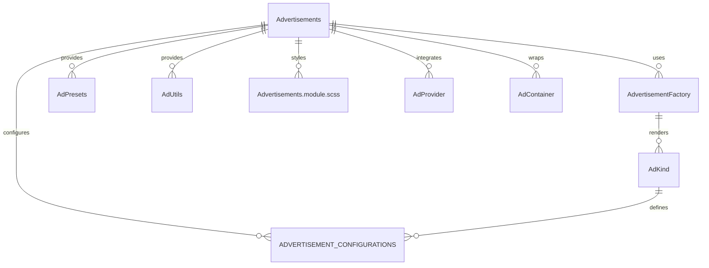

# Advertisements Component System (`src/components/Advertisements`)

This folder implements a **unified, configuration-driven advertisement system** for the app. It provides a DRY, extensible way to add banners, interstitials, native cards, sticky bars, floating widgets, toasts, modals, and more, all with minimal code duplication and maximum flexibility.

## Key Concepts

- **Advertisements.tsx**: The main component for rendering single or multiple ads. Handles all ad logic, analytics, provider integration, and layout.
- **factory.tsx**: The core factory and utility system. Exposes `AdvertisementFactory`, `AdPresets`, and helpers for creating any ad type by kind, with smart configuration and batch utilities.
- **configurations.ts**: Centralizes all configuration types, ad kinds, and default settings. Defines the available ad types, variants, sizes, and provider support.
- **Advertisements.module.scss**: All styles for ad components, including layouts, variants, and responsive design.
- **index.ts**: Exports all main symbols for easy import elsewhere.

## How It Works

- **Configuration-driven**: Each ad type (banner, interstitial, native card, sticky bar, etc.) is defined by a `kind` and a configuration object. The factory system uses these to render the correct UI and manage state.
- **Ultra-DRY**: All ad UIs share the same core logic and styles, with only the configuration and content changing per kind.
- **Presets & Utilities**: Use `AdPresets` or `AdvertisementFactory` to quickly add ads anywhere in the app, with sensible defaults and easy overrides.
- **Provider & Analytics Support**: Built-in support for multiple ad providers (AdSense, Adsterra, custom, etc.) and analytics hooks for impressions, clicks, and more.
- **Responsive & Smart Layouts**: Easily switch between stack, carousel, grid, and single layouts, with responsive breakpoints and auto-rotation.

## Example Usage

```tsx
import {
	AdvertisementFactory,
	AdPresets,
} from 'src/components/Advertisements';

// Render a banner ad
{
	AdvertisementFactory.create('banner', {
		title: 'Ad Title',
		ctaText: 'Click Here',
	});
}

// Render a set of ads for a website use case
{
	AdvertisementFactory.createAdSet('website', {
		'banner': { title: 'Header Ad' },
		'native-card': { title: 'In-Content Ad' },
	});
}

// Render a sticky bar preset
{
	AdPresets.newsletterPromo({ title: 'Subscribe Now!' });
}
```

## Entity Relationship Diagram (ERD)



**Legend:**

- `Advertisements` is the main entry point for all ad UIs.
- `AdvertisementFactory` is the internal logic for rendering each kind.
- `AdPresets` and `AdUtils` provide helpers and shortcuts.
- `AdKind` and `ADVERTISEMENT_CONFIGURATIONS` define the available types and settings.
- `Advertisements.module.scss` provides all styles.
- `AdProvider` enables integration with ad networks.
- `AdContainer` is the multi-ad wrapper for batch layouts.

---

## Function-by-Function Reference

### Advertisements.tsx

- **Advertisements**: Main React component for rendering a single or multiple advertisements. Handles ad state, analytics, provider loading, layout, and event hooks. Accepts all props defined in `AdvertisementProps`.
- **AdContainer**: Alias for `Advertisements`, used for backward compatibility and batch ad layouts.
- **AdContainerImplementation**: Internal component for rendering a batch of ads with advanced layout, rotation, and provider logic.
- **AdvertisementProps**: TypeScript interface defining all props for a single ad, including content, kind, analytics, provider, and display options.
- **AdContainerProps**: Interface for props accepted by the ad container (multi-ad) component.

### factory.tsx

- **AdvertisementFactory**: Main class for DRY ad creation. All methods are static.
  - `createWithConfig(kind, content, customProps)`: Creates an ad of the given kind, merging configuration and props.
  - `create(kind, content, customProps)`: Shorthand for `createWithConfig`.
  - `createBatch(specs)`: Creates multiple ads at once from an array of specs.
  - `createConditional(condition, kind, content, props)`: Creates an ad only if the condition is true.
  - `createSmart(context, content, props)`: Chooses ad type based on context (e.g., mobile, game, engagement).
  - `createAdSet(useCase, contentMap, options)`: Creates a set of ads for a use case (website, mobile, game, etc.) with shared or per-position props.
- **AdUtils**: Utility object for batch and conditional ad creation.
  - `batchCreate(requests)`: Batch-creates ads from an array of requests.
  - `conditionalCreate(conditions)`: Batch-creates ads only if their conditions are true.
  - `responsiveCreate(content, breakpoints)`: Creates ads for mobile, tablet, and desktop breakpoints.
  - `abTestCreate(content, variants, testGroup)`: Creates an ad for A/B testing, choosing a variant by weight or group.
- **AdPresets**: Object of preset ad creators for common use cases.
  - `websiteHeader(content)`, `websiteFooter(content)`, `websiteInContent(content)`, `websiteSidebar(content)`, `mobileFullscreen(content)`, `mobileReward(content)`, `gameBillboard(content)`, `gameReward(content)`, `productPromo(content)`, `cartAbandonment(content)`, `saleNotification(content)`, `sponsoredContent(content)`, `newsletterPromo(content)`: Each returns a preconfigured ad for the use case.

### configurations.ts

- **AdVariant, AdSize, AdPosition, AdState, AdDisplayMode, AdvertisementKind, ExtendedAdKind**: TypeScript types/enums for all ad configuration options.
- **AdContent, AdTargeting, AdMetrics, AdAnimation, AdConfiguration, AdvertisementConfiguration**: Interfaces for ad content, targeting, analytics, animation, and configuration.
- **ADVERTISEMENT_CONFIGURATIONS**: Central object mapping each ad kind to its default configuration.
- **getAdvertisementConfig(kind)**: Returns the configuration for a given ad kind.
- **createAdvertisementConfig(baseKind, overrides)**: Creates a new ad configuration by overriding a base kind.
- **isAdvertisementKind(kind)**: Type guard to check if a string is a valid ad kind.
- **createAnalyticsEvent(eventType, adId, adKind, metadata)**: Creates an analytics event object for ad tracking.
- **AdProviderType, AdProviderConfig, AdProvider, AdAnalyticsEvent, AdAnalyticsHooks, AdAnalyticsProvider**: Types and interfaces for ad providers and analytics.
- **createAdSenseProvider(config)**, **createAdsterraProvider(config)**, **createCustomProvider(config)**: Factory functions for creating ad provider objects.
- **createGoogleAnalyticsProvider(trackingId)**, **createCustomAnalyticsProvider(config)**: Factory functions for analytics providers.

### index.ts

- Re-exports all main components, types, configuration, factory, and presets for easy import.
- Provides backward compatibility aliases for legacy codebases.

---

For more details, see the code comments in each file or the exported types in `index.ts`.
