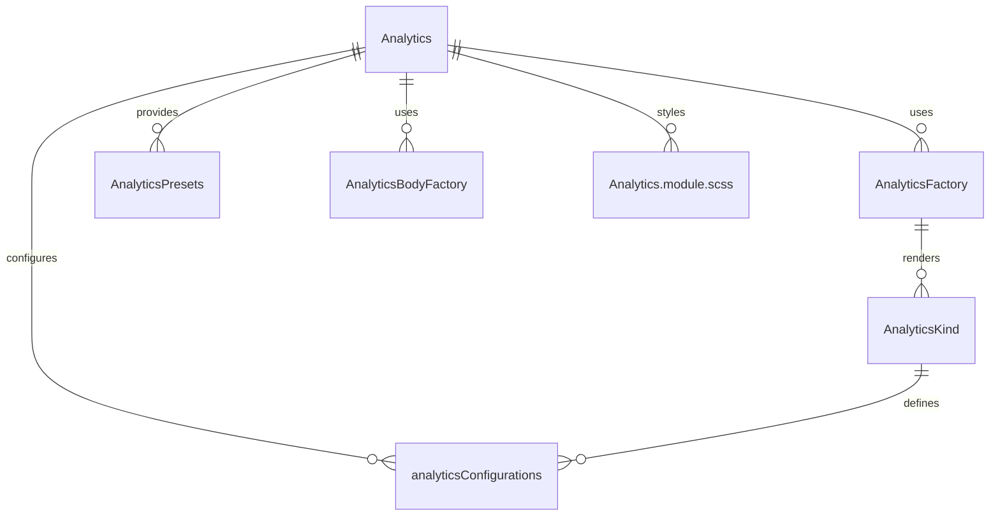

# Analytics Component System (`src/components/Analytics`)

This folder implements a **unified, configuration-driven analytics and tracking system** for the UI kit. It provides reusable, DRY analytics dashboards, charts, metrics, heatmaps, funnels, reports, and real-time analytics, all with minimal code duplication and maximum flexibility.

## Key Concepts

- **Analytics.tsx**: The main analytics component, supporting all analytics types (dashboard, chart, metric, heatmap, funnel, cohort, report, realtime) via a single, flexible API.
- **factory.tsx**: The core factory and body system. Exposes `AnalyticsFactory`, `AnalyticsPresets`, and utilities for creating any analytics component by kind. Handles state, data, and rendering logic for each analytics kind.
- **configurations.ts**: Centralizes all configuration types and presets for analytics components. Defines the available kinds, default layouts, and settings.
- **Analytics.module.scss**: All styles for analytics dashboards, charts, and event logs.
- **index.ts**: Exports all main symbols for easy import elsewhere.

## How It Works

- **Configuration-driven**: Each analytics type (dashboard, chart, metric, etc.) is defined by a `kind` and a configuration object. The factory system uses these to render the correct UI and manage state.
- **Ultra-DRY**: All analytics UIs share the same core logic and styles, with only the configuration and data source changing per kind.
- **Presets & Utilities**: Use `AnalyticsPresets` or `AnalyticsFactory` to quickly add analytics dashboards, event loggers, or charts anywhere in the app, with sensible defaults and easy overrides.
- **Integration**: Designed to integrate with Redux, custom event buses, or third-party analytics providers.

## Example Usage

```tsx
import {
	AnalyticsFactory,
	AnalyticsPresets,
} from 'src/components/Analytics';

// Render a basic analytics dashboard
<AnalyticsFactory kind='dashboard' data={analyticsData} />;

// Render a preset event logger
{
	AnalyticsPresets.Reports({ data: reportData });
}
```

## Entity Relationship Diagram (ERD)



**Legend:**

- `Analytics` is the main entry point for analytics UIs.
- `AnalyticsFactory` is the internal logic for rendering each kind.
- `AnalyticsPresets` and `AnalyticsBodyFactory` provide helpers and shortcuts.
- `AnalyticsKind` and `analyticsConfigurations` define the available types and settings.
- `Analytics.module.scss` provides all styles.

---

For more details, see the code comments in each file or the exported types in `index.ts`.
