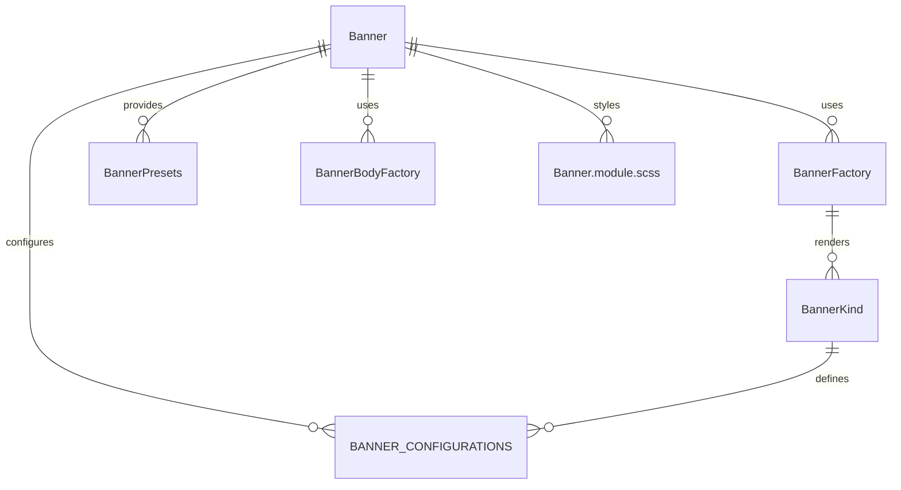

# Banner Component System (`src/components/Banner`)

This folder implements a **unified, configuration-driven banner/notification system** for the UI kit. It provides reusable, DRY banners, notifications, toasts, status bars, and global alerts, all with minimal code duplication and maximum flexibility.

## Key Concepts

- **Banner.tsx**: The main banner component, supporting all banner types (feedback, notification, toast, status, global) via a single, flexible API.
- **factory.tsx**: The core factory and body system. Exposes `BannerFactory`, `BannerPresets`, and utilities for creating any banner by kind. Handles state, data, and rendering logic for each banner kind.
- **configurations.ts**: Centralizes all configuration types and presets for banners. Defines the available kinds, default layouts, and settings.
- **Banner.module.scss**: All styles for banners, notifications, toasts, and status bars.
- **index.ts**: Exports all main symbols for easy import elsewhere.

## How It Works

- **Configuration-driven**: Each banner type (feedback, notification, toast, etc.) is defined by a `kind` and a configuration object. The factory system uses these to render the correct UI and manage state.
- **Ultra-DRY**: All banner UIs share the same core logic and styles, with only the configuration and content changing per kind.
- **Presets & Utilities**: Use `BannerPresets` or `BannerFactory` to quickly add banners, notifications, or toasts anywhere in the app, with sensible defaults and easy overrides.

## Example Usage

```tsx
import {
	BannerFactory,
	BannerPresets,
} from 'src/components/Banner';

// Render a feedback banner
<BannerFactory kind='feedback' message='Game completed!' />;

// Render a toast notification
{
	BannerPresets.success('Saved successfully!');
}
```

## Entity Relationship Diagram (ERD)



**Legend:**

- `Banner` is the main entry point for banner UIs.
- `BannerFactory` is the internal logic for rendering each kind.
- `BannerPresets` and `BannerBodyFactory` provide helpers and shortcuts.
- `BannerKind` and `BANNER_CONFIGURATIONS` define the available types and settings.
- `Banner.module.scss` provides all styles.

---

## Function-by-Function Reference

### Banner.tsx

- **Banner**: Main React component for rendering a banner, notification, toast, or status bar. Handles auto-close, close button, and applies the correct styles and ARIA attributes. Accepts all props defined in `BannerProps`.
- **BannerProps**: TypeScript interface defining all props for a banner, including content, kind, type, position, auto-close, and event handlers.

### factory.tsx

- **BannerBodyFactory**: React component that renders the content of a banner based on its kind and configuration. Used internally by the factory for DRY rendering.
- **BannerFactory**: Main factory component for DRY banner creation. All methods are static or functional.
  - Renders a banner of the given kind, merging configuration and props.
- **BannerFactoryClass**: Class with static methods for programmatic banner creation.
  - `create(kind, props)`: Creates a banner of the given kind with the provided props.
  - `feedback(message, props)`: Creates a feedback banner.
  - `notification(message, type, props)`: Creates a notification banner of a specific type (burn, achievement, system, taunt, etc.).
  - `toast(message, type, props)`: Creates a toast banner of a specific type (success, error, warning, info).
  - `status(player, props)`: Creates a status bar banner for VS games.
  - `global(message, props)`: Creates a global toast banner.
- **Ban**: Ultra-short alias for `BannerFactoryClass`.
- **BannerPresets**: Object of preset banner creators for common use cases.
  - `gameComplete(message)`, `gameFeedback(message)`, `burnPlayer(message)`, `achievement(message)`, `systemAlert(message)`, `taunt(message)`, `success(message)`, `error(message)`, `warning(message)`, `info(message)`, `vsStatus(player, opponent, timer)`, `globalToast(message)`: Each returns a preconfigured banner for the use case.

### configurations.ts

- **BannerConfiguration**: TypeScript interface for all banner configuration options.
- **BANNER_CONFIGURATIONS**: Central object mapping each banner kind to its default configuration.
- **feedbackBanner, notificationBanner, toastBanner, statusBanner, globalToastBanner, burnNotification, achievementNotification, systemNotification, tauntNotification, successToast, errorToast, warningToast, infoToast, vsStatusBar**: Predefined configuration objects for each banner type.
- **BannerKind, BannerType, BannerVariant, BannerPosition**: TypeScript types/enums for all banner configuration options.

### index.ts

- Re-exports all main components, types, configuration, factory, and presets for easy import.
- Provides backward compatibility aliases for legacy codebases.

---

For more details, see the code comments in each file or the exported types in `index.ts`.
