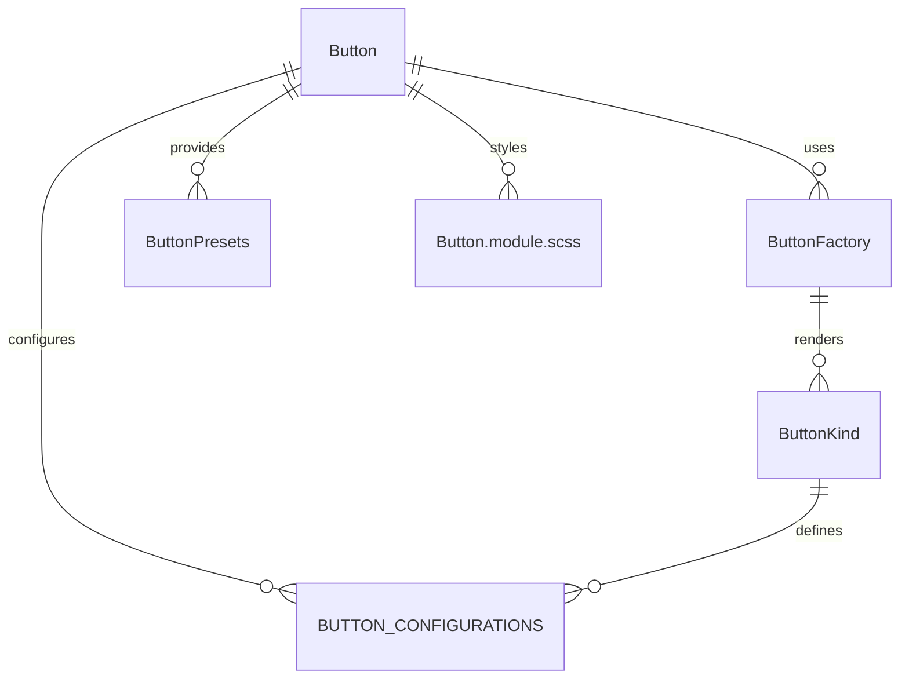

# Button Component System (`src/components/Button`)

This folder implements a **unified, configuration-driven button system** for the UI kit. It provides reusable, DRY buttons, icon buttons, word buttons, copy-link buttons, navigation buttons, and more, all with minimal code duplication and maximum flexibility.

## Key Concepts

- **Button.tsx**: The main button component, supporting all button types (primary, secondary, danger, icon, word, copy-link, etc.) via a single, flexible API.
- **factory.tsx**: The core factory and utility system. Exposes `ButtonFactory`, `ButtonPresets`, and helpers for creating any button by kind, with smart configuration and batch utilities.
- **configurations.ts**: Centralizes all configuration types, button kinds, and default settings. Defines the available button types, variants, and behaviors.
- **Button.module.scss**: All styles for buttons, including variants, sizes, icon layouts, and accessibility.
- **index.ts**: Exports all main symbols for easy import elsewhere.

## How It Works

- **Configuration-driven**: Each button type (primary, secondary, icon, etc.) is defined by a `kind` and a configuration object. The factory system uses these to render the correct UI and manage state.
- **Ultra-DRY**: All button UIs share the same core logic and styles, with only the configuration and content changing per kind.
- **Presets & Utilities**: Use `ButtonPresets` or `ButtonFactory` to quickly add buttons, button groups, or dialog actions anywhere in the app, with sensible defaults and easy overrides.

## Example Usage

```tsx
import { ButtonFactory, ButtonPresets } from 'src/components/Button';

// Render a primary button
<ButtonFactory.create('primary', { text: 'Save', onClick: handleSave }) />

// Render a save/cancel form button group
{ButtonPresets.saveForm(handleSave, handleCancel).save}
{ButtonPresets.saveForm(handleSave, handleCancel).cancel}
```

## Entity Relationship Diagram (ERD)



**Legend:**

- `Button` is the main entry point for button UIs.
- `ButtonFactory` is the internal logic for rendering each kind.
- `ButtonPresets` provides helpers and shortcuts for common button groups.
- `ButtonKind` and `BUTTON_CONFIGURATIONS` define the available types and settings.
- `Button.module.scss` provides all styles.

---

For more details, see the code comments in each file or the exported types in `index.ts`.
