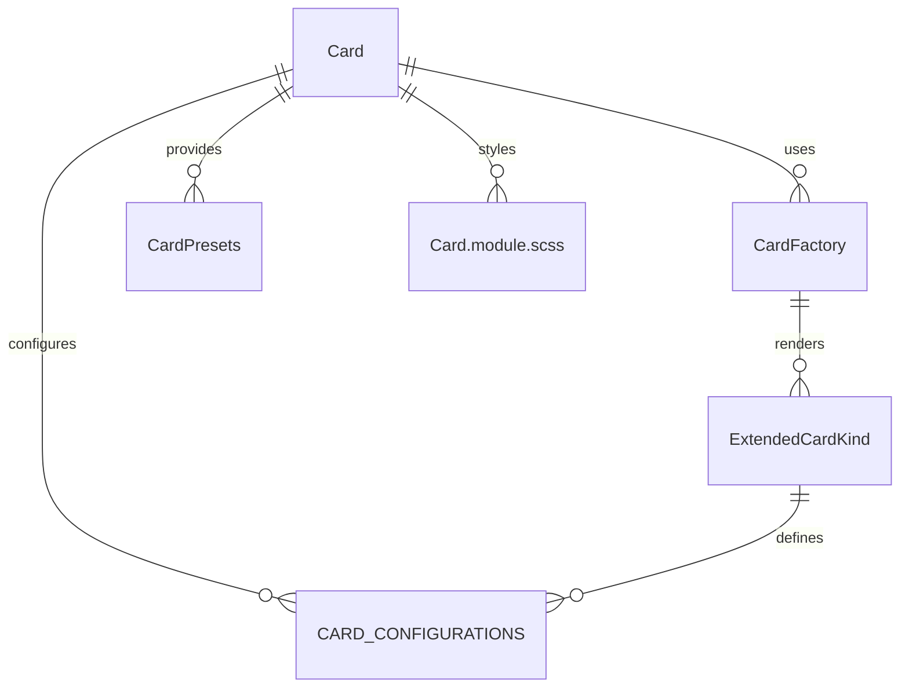

# Card Component System (`src/components/Card`)

This folder implements a **unified, configuration-driven card system** for the UI kit. It provides reusable, DRY cards for friends, games, profiles, notifications, stats, achievements, and more, all with minimal code duplication and maximum flexibility.

## Key Concepts

- **Card.tsx**: The main card component, supporting all card types (default, elevated, outlined, filled, friend, game, profile, notification, stats, etc.) via a single, flexible API.
- **factory.tsx**: The core factory and utility system. Exposes `CardFactory`, `CardPresets`, and helpers for creating any card by kind, with smart configuration and batch utilities.
- **configurations.ts**: Centralizes all configuration types, card kinds, and default settings. Defines the available card types, variants, and behaviors.
- **Card.module.scss**: All styles for cards, including variants, sizes, and specific card kinds.
- **index.ts**: Exports all main symbols for easy import elsewhere.

## How It Works

- **Configuration-driven**: Each card type (friend, game, profile, notification, etc.) is defined by a `kind` and a configuration object. The factory system uses these to render the correct UI and manage state.
- **Ultra-DRY**: All card UIs share the same core logic and styles, with only the configuration and content changing per kind.
- **Presets & Utilities**: Use `CardPresets`, `CardFactory`, or `QuickCards` to quickly add cards anywhere in the app, with sensible defaults and easy overrides.

## Example Usage

```tsx
import {
	CardFactory,
	CardPresets,
} from 'src/components/Card';

// Render a friend card
<CardFactory kind='friend' friend={friendData} />;

// Render a notification card
{
	CardPresets.NotificationCard({
		title: 'Alert',
		content: 'Something happened!',
	});
}
```

## Entity Relationship Diagram (ERD)



**Legend:**

- `Card` is the main entry point for card UIs.
- `CardFactory` is the internal logic for rendering each kind.
- `CardPresets` and `QuickCards` provide helpers and shortcuts for common card types.
- `ExtendedCardKind` and `CARD_CONFIGURATIONS` define the available types and settings.
- `Card.module.scss` provides all styles.

---

## Function-by-Function Reference

### Card.tsx

- **Card**: Main React component for rendering a card of any kind. Handles configuration, layout, and specialized content for friend, stats, notification, and default cards. Accepts all props defined in `CardProps`.
- **CardProps**: TypeScript interface defining all props for a card, including content, kind, variant, size, padding, and specialized props for friend, notification, and stats cards.

### factory.tsx

- **CardFactory**: Functional component for rendering a card of a given kind. Passes all props to the main `Card` component.
- **C**: Short alias for `CardFactory`.
- **CardPresets**: Object of preset card creators for common use cases.
  - `FriendCard(props)`, `ProfileCard(props)`, `NotificationCard(props)`, `StatsCard(props)`, `GameCard(props)`, `PuzzleCard(props)`, `RoomCard(props)`, `MatchCard(props)`, `InfoCard(props)`, `ActionCard(props)`, `ContentCard(props)`: Each returns a preconfigured card for the use case.
- **CardFactoryClass**: Class with static methods for programmatic card creation.
  - `create(kind, props)`: Creates a card of the given kind with the provided props.
  - `createWithConfig(kind, configOverride, props)`: Creates a card with a custom configuration override.
  - `friend(props)`, `game(props)`, `profile(props)`, `notification(props)`, `stats(props)`: Quick creators for common card types.
- **QuickCards**: Object of ultra-short aliases and common card patterns.
  - `f(props)`, `g(props)`, `p(props)`, `n(props)`, `s(props)`: Ultra-short aliases for friend, game, profile, notification, and stats cards.
  - `info(props)`, `action(props)`, `display(props)`: Common card patterns for info, action, and display cards.

### configurations.ts

- **CardVariant, CardConfiguration, ExtendedCardKind**: TypeScript types/enums for all card configuration options.
- **CARD_CONFIGURATIONS**: Central object mapping each card kind to its default configuration.
- **createCardConfig(baseKind, overrides)**: Helper function to create a card configuration by overriding a base kind.
- **CARD_GROUPS**: Common card groupings for UI patterns.
- **QUICK_CARDS**: Quick access to commonly used card configurations.

### index.ts

- Re-exports all main components, types, configuration, factory, and presets for easy import.
- Provides backward compatibility aliases for legacy codebases.

---

For more details, see the code comments in each file or the exported types in `index.ts`.
