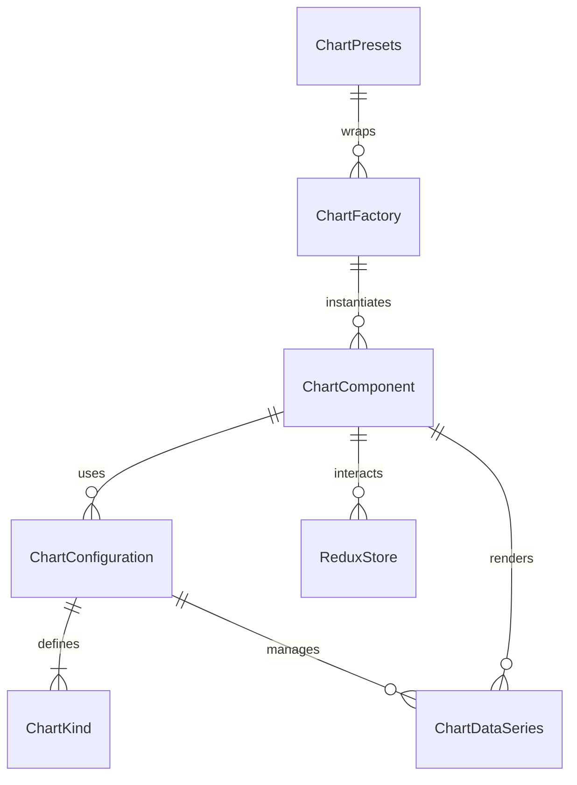

# Chart Component Folder Explanation

## Overview

The `Chart` folder implements a highly flexible, configuration-driven chart UI system for modern React applications. It provides a single, unified `Chart` component that can render a wide variety of chart-related UIs—such as legends, tooltips, filter controls, and chart controls—based on a `kind` prop and configuration. The system is designed to be DRY, extensible, and easy to use, supporting both direct usage and factory/preset patterns for rapid development.

## Key Files

- **Chart.tsx**: The main React component. It dynamically renders different chart UIs (legends, tooltips, filters, controls) based on the `kind` and configuration props. It supports Redux integration for stateful features like selection and filtering.
- **configurations.ts**: Centralizes all chart configuration presets. Defines the `ChartKind` type, configuration interfaces, and a map of default configurations for each kind. The `getChartConfig` function resolves the correct config for a given kind.
- **factory.ts**: Provides a `ChartFactory` function and a set of `ChartPresets` for easy instantiation of common chart UIs. This enables DRY usage and rapid prototyping.
- **Chart.module.scss**: Contains all styles for the chart component, including layout, variants, legend, filter, tooltip, and control styles. Uses SCSS modules and project-wide variables/mixins for consistency.
- **index.ts**: Barrel file that exports the main component, types, configurations, factory, and presets for easy import elsewhere.

## Usage Patterns

- **Direct Usage**: Import and use `<Chart kind="legend-horizontal" ... />` with custom props.
- **Factory/Presets**: Use `ChartFactory` or `ChartPresets.legendHorizontal()` for DRY, configuration-driven instantiation.
- **Redux Integration**: The component uses Redux for managing selected series, search/filter state, and supports callbacks for advanced interactivity.

## Extensibility

- Add new chart kinds or variants by updating `configurations.ts`.
- Add new presets in `factory.ts` for common use cases.
- Customize styles in `Chart.module.scss`.

## ERD (Entity Relationship Diagram)

**Legend:**

- `ChartComponent`: The main Chart React component (`Chart.tsx`)
- `ChartConfiguration`: Configuration object for a chart kind
- `ChartKind`: Enum/type for chart UI variants
- `ChartDataSeries`: Data for each chart series/legend/filter
- `ReduxStore`: Redux state for selection/filtering
- `ChartFactory`: Factory function for DRY instantiation
- `ChartPresets`: Predefined factory presets

---

## Function-by-Function Reference

### Chart.tsx

- **Chart**: Main React component for rendering chart UIs (legends, tooltips, filters, controls) based on the `kind` and configuration. Handles Redux state for selection/filtering, applies styles, and supports callbacks for interactivity. Accepts all props defined in `ChartProps`.
- **ChartProps**: TypeScript interface defining all props for a chart, including kind, data, configuration overrides, features, styling, and callbacks.

### configurations.ts

- **ChartKind, ChartVariant, ChartPosition, ChartDataSeries, ChartConfiguration**: TypeScript types/enums for all chart configuration options.
- **CHART_CONFIGURATIONS**: Central object mapping each chart kind to its default configuration.
- **getChartConfig(kind)**: Returns the configuration for a given chart kind, or a default if not found.

### factory.ts

- **ChartFactory(configOrKind)**: Factory function that returns a function for creating a chart of the given kind/configuration. Enables DRY instantiation of chart UIs.
- **CF**: Ultra-short alias for `ChartFactory`.
- **ChartPresets**: Object of preset chart creators for common use cases.
  - `legend`, `legendHorizontal`, `legendVertical`, `legendGrid`, `legendMinimal`, `tooltip`, `tooltipSimple`, `tooltipDetailed`, `tooltipCustom`, `filterControls`, `filterCheckboxes`, `filterButtons`, `filterDropdown`, `filterMultiSelect`, `chartControls`, `zoomControls`, `timeRangeSelector`, `dataSeriesToggle`, `dashboardLegend`, `gameStatsFilter`: Each returns a preconfigured chart for the use case.

### index.ts

- Re-exports all main components, types, configuration, factory, and presets for easy import.
- Provides backward compatibility aliases for legacy codebases.

---

For more details, see the code comments in each file or the exported types in `index.ts`.
