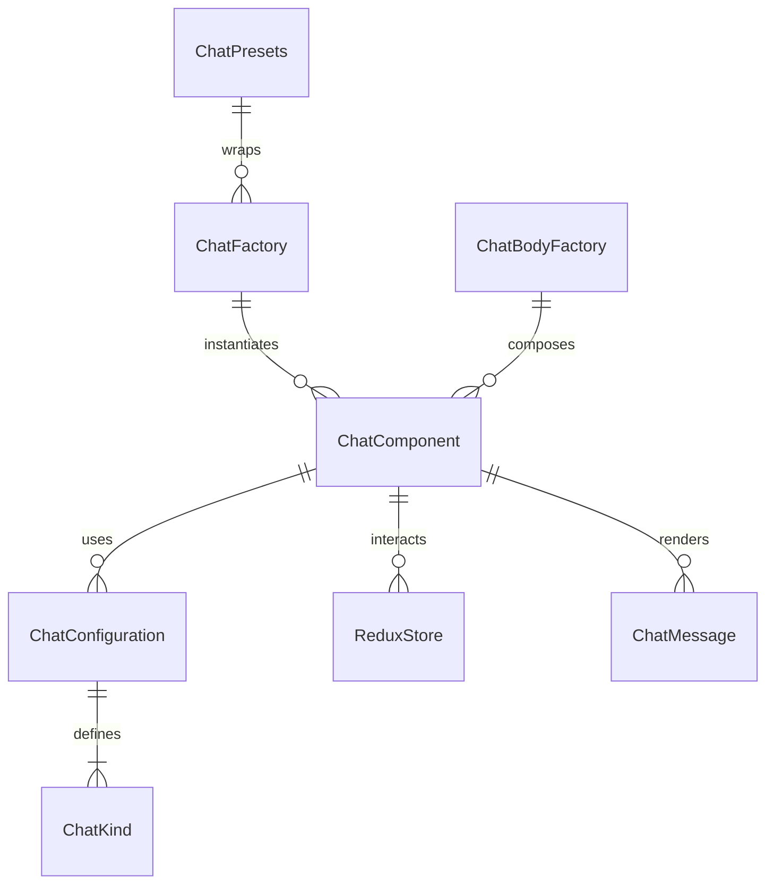

# Chat Component Folder Explanation

## Overview

The `Chat` folder provides a unified, configuration-driven chat UI system for React applications. It enables rendering of multiple chat variants (friend, in-match, match, general, quick chat) using a single, DRY component and factory pattern. The system supports both presentational and high-level chat logic, Redux integration for state, and is fully compatible with Storybook and other consumers.

## Key Files

- **Chat.tsx**: The main unified Chat component. Renders either a presentational chat window or delegates to the factory for configuration-driven chat UIs.
- **configurations.ts**: Centralizes all chat configuration presets. Defines the `ChatKind` type, configuration interfaces, and a map of default configurations for each kind. Used by the factory to drive chat behavior and appearance.
- **factory.tsx**: Provides the `ChatFactory`, `ChatBodyFactory`, and `ChatPresets` for DRY instantiation of chat UIs. Handles merging of configuration, Redux state, and rendering of chat messages, input, and quick chat options.
- **Chat.module.scss**: Contains all styles for the chat component, including layout, variants, message bubbles, input, and quick chat bar. Uses SCSS modules and project-wide mixins/variables.
- **index.ts**: Barrel file that exports the main component, types, configurations, factory, and presets for easy import elsewhere.

## Usage Patterns

- **Direct Usage**: Use `<Chat variant="friend" ... />` for a styled chat window, or `<Chat kind="friend" ... />` for a configuration-driven chat with full logic.
- **Factory/Presets**: Use `ChatFactory`, `ChatFactoryClass`, or `ChatPresets` for DRY, configuration-driven instantiation of common chat UIs.
- **Redux Integration**: The chat system uses Redux for managing input state and other chat-specific state, ensuring isolation between chat instances.

## Extensibility

- Add new chat kinds or variants by updating `configurations.ts`.
- Add new presets in `factory.tsx` for common use cases.
- Customize styles in `Chat.module.scss`.

## ERD (Entity Relationship Diagram)

**Legend:**

- `ChatComponent`: The main Chat React component (`Chat.tsx`)
- `ChatConfiguration`: Configuration object for a chat kind
- `ChatKind`: Enum/type for chat UI variants
- `ReduxStore`: Redux state for chat input and state
- `ChatFactory`: Factory function for DRY instantiation
- `ChatPresets`: Predefined factory presets
- `ChatBodyFactory`: Renders the chat body/messages/input
- `ChatMessage`: Individual chat message objects

## Function-by-Function Reference

### Chat.tsx

- **Chat (component)**: Unified chat component. If `kind` is provided, delegates to `ChatFactory` for configuration-driven chat; otherwise, renders a presentational chat window with header, content, and optional close button.

### configurations.ts

- **ChatConfiguration (interface)**: Defines the shape of a chat configuration object, including kind, variant, position, header/input/close button visibility, quick options, title, placeholder, avatar, and extensibility.
- **friendChat, inMatchChat, matchChat, generalChat, vsQuickChat (objects)**: Default configuration objects for each chat kind.
- **CHAT_CONFIGURATIONS (object)**: Map of all chat kinds to their configuration objects, including aliases for backward compatibility.
- **ExtendedChatKind (type)**: Type union of all valid chat kind keys.
- **ChatKind, ChatVariant, ChatPosition (types)**: Type aliases for chat kind, variant, and position values.

### factory.tsx

- **ChatBodyFactory (component)**: Renders the chat body (messages, input, quick chat bar) based on the provided kind and configuration. Handles Redux state for input, message rendering, and input events.
- **renderMessage (function, inside ChatBodyFactory)**: Renders a single chat message with appropriate style and metadata.
- **ChatFactory (component)**: Ultra-DRY chat creation component. Merges configuration and props, renders a chat window with a `ChatBodyFactory` inside. Handles all configuration-driven chat instantiation.
- **ChatFactoryClass (class)**: Static class with methods for creating chat components by kind. Provides `create`, `friend`, `inMatch`, `match`, and `general` methods for DRY instantiation.
- **ChatFactoryShortcut (alias)**: Alias for `ChatFactoryClass` for convenience.
- **ChatPresets (object)**: Predefined chat factory presets for common chat types (friend, in-match, match, general), with typical prop overrides.

### index.ts

- **Exports**: Re-exports all main components, types, configurations, and presets for easy import.

## Summary

This folder provides a robust, unified, and extensible chat UI system. All chat-related UIs are driven by configuration, making it easy to add new features, maintain consistency, and avoid code duplication. The ERD above shows the relationships between the main entities in this system.
