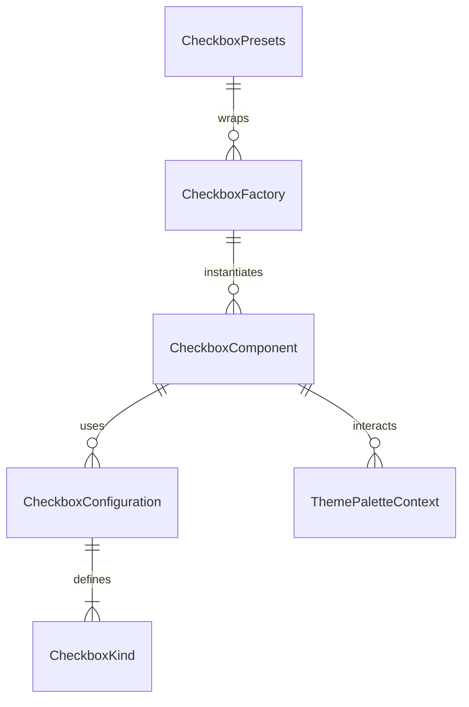

# Checkbox Component Folder Explanation

## Overview

The `Checkbox` folder implements a , configuration-driven checkbox system for React applications. It supports multiple checkbox variants (standard, toggle, switch, dark mode toggle, and custom) using a single, DRY component and factory pattern. The system is designed for flexibility, accessibility, and rapid development, with full support for custom styles, sizes, and behaviors.

## Key Files

- **Checkbox.tsx**: The main Checkbox component. Renders all checkbox types based on the `kind` prop and configuration. Handles label positioning, error/helper text, dark mode context, and accessibility.
- **configurations.ts**: Centralizes all checkbox configuration presets. Defines the `CheckboxKind` type, configuration interfaces, and a map of default configurations for each kind. Used by the factory and main component.
- **factory.tsx**: Provides the `CheckboxFactory` class, a factory component, and `CheckboxPresets` for DRY instantiation of checkboxes. Enables rapid creation of common patterns and custom checkboxes.
- **Checkbox.module.scss**: Contains all styles for the checkbox component, including layout, variants, toggle/switch styles, dark mode, error/helper text, and responsive design. Uses SCSS modules and project-wide mixins/variables.
- **index.ts**: Barrel file that exports the main component, types, configurations, factory, and presets for easy import elsewhere. Also provides a legacy-compatible `DarkModeToggle` export.

## Usage Patterns

- **Direct Usage**: Use `<Checkbox kind="toggle" ... />` for a toggle, `<Checkbox kind="switch" ... />` for a switch, or `<Checkbox ... />` for a standard checkbox.
- **Factory/Presets**: Use `CheckboxFactory`, `C`, or `CheckboxPresets` for DRY, configuration-driven instantiation of common checkbox UIs.
- **Dark Mode Integration**: The `dark-mode-toggle` kind integrates with the theme context for seamless dark mode switching.

## Extensibility

- Add new checkbox kinds or variants by updating `configurations.ts`.
- Add new presets in `factory.tsx` for common use cases.
- Customize styles in `Checkbox.module.scss`.

## ERD (Entity Relationship Diagram)

**Legend:**

- `CheckboxComponent`: The main Checkbox React component (`Checkbox.tsx`)
- `CheckboxConfiguration`: Configuration object for a checkbox kind
- `CheckboxKind`: Enum/type for checkbox UI variants
- `CheckboxFactory`: Factory class/component for DRY instantiation
- `CheckboxPresets`: Predefined factory presets
- `ThemePaletteContext`: Theme context for dark mode integration

## Summary

This folder provides a robust, , and extensible checkbox UI system. All checkbox-related UIs are driven by configuration, making it easy to add new features, maintain consistency, and avoid code duplication. The ERD above shows the relationships between the main entities in this system.
