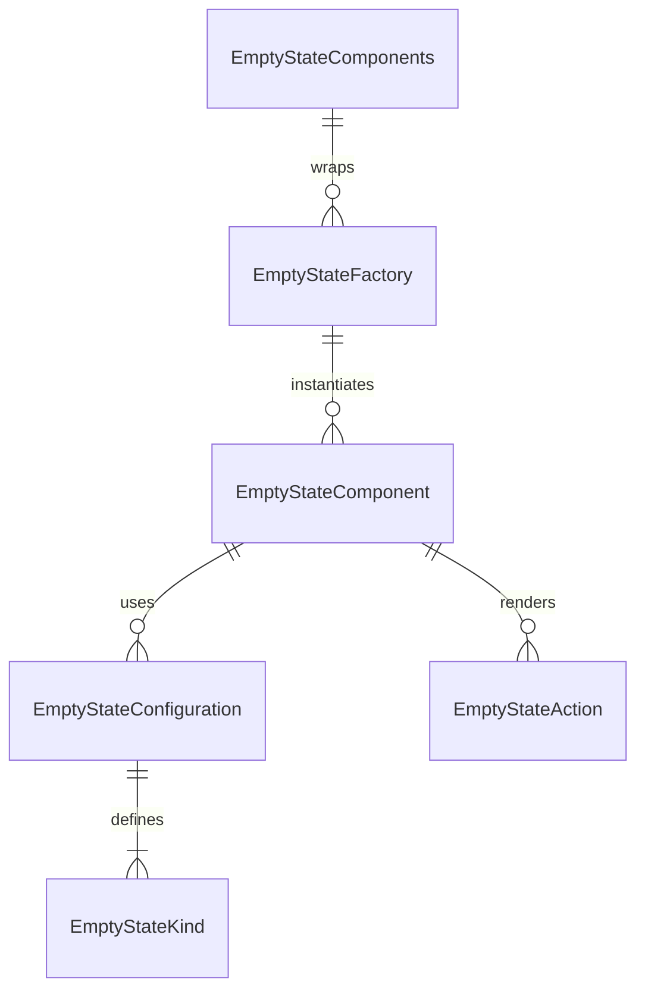

# EmptyState Component Folder Explanation

## Overview

The `EmptyState` folder implements a , configuration-driven system for displaying empty, error, and placeholder states in React applications. It supports a wide variety of empty state scenarios (data, user, game, content, error) using a single, DRY component and factory pattern. The system is designed for flexibility, rapid development, and visual consistency, with support for custom icons, illustrations, actions, and layouts.

## Key Files

- **EmptyState.tsx**: The main EmptyState component. Renders empty state UIs based on the `kind` prop and configuration, supporting overrides for content, actions, and layout.
- **configurations.ts**: Centralizes all empty state configuration presets. Defines the `EmptyStateKind` type, configuration interfaces, and a map of default configurations for each kind. Used by the factory and main component.
- **factory.ts**: Provides the `EmptyStateFactory` class and `EmptyStateComponents` for DRY instantiation of empty states. Enables rapid creation of common patterns and custom empty states.
- **EmptyState.module.scss**: Contains all styles for the empty state component, including layout, variants, icon/illustration styles, actions, and responsive design. Uses SCSS modules and project-wide mixins/variables.
- **index.ts**: Barrel file that exports the main component, types, configurations, factory, and pre-configured components for easy import elsewhere.

## Usage Patterns

- **Direct Usage**: Use `<EmptyState kind="no-data" ... />` for a data empty state, or override content/actions as needed.
- **Factory/Pre-configured Components**: Use `EmptyStateFactory` or `EmptyStateComponents` for DRY, configuration-driven instantiation of common empty state UIs.
- **Custom Content**: Pass children to render custom content inside the empty state.

## Extensibility

- Add new empty state kinds or variants by updating `configurations.ts`.
- Add new pre-configured components in `factory.ts` for common use cases.
- Customize styles in `EmptyState.module.scss`.

## ERD (Entity Relationship Diagram)

**Legend:**

- `EmptyStateComponent`: The main EmptyState React component (`EmptyState.tsx`)
- `EmptyStateConfiguration`: Configuration object for an empty state kind
- `EmptyStateKind`: Enum/type for empty state UI variants
- `EmptyStateFactory`: Factory class for DRY instantiation
- `EmptyStateComponents`: Pre-configured factory components
- `EmptyStateAction`: Action button objects for user interaction

## Function-by-Function Reference

### EmptyState.tsx

- **EmptyState (component)**: Renders the empty state UI. Accepts props for customizing the icon, message, illustration, and optional actions. Handles layout, accessibility, and configuration resolution for empty state visuals.
- **renderIcon**: Renders the icon for the empty state if enabled and present in the configuration.
- **renderIllustration**: Renders an illustration image if enabled and present in the configuration.
- **renderAction**: Renders a single action button (primary, secondary, or custom) for the empty state.
- **renderActions**: Renders all configured action buttons for the empty state.

### configurations.ts

- **EmptyStateKind, EmptyStateVariant, EmptyStateAction (types)**: Type definitions for empty state kinds, variants, and action objects.
- **EmptyStateConfiguration (interface)**: Defines the shape of an empty state configuration object, including content, actions, and layout options.
- **getEmptyStateConfig**: Returns the configuration object for a given empty state kind.

### factory.ts

- **EmptyStateFactory (class)**: Provides static methods to create configured empty state components from configuration objects or by kind.
  - `create`: Returns a forwardRef-wrapped component with the given configuration and props.
  - `createFromKind`: Returns a forwardRef-wrapped component for a given kind using its configuration.
- **EmptyStateComponents (object)**: Pre-configured empty state components for common scenarios (e.g., `NoData`, `NoResults`, `EmptyTable`, `NoFriends`, `PermissionDenied`, etc.).

### index.ts

- **Exports**: Re-exports the main `EmptyState` component, types, configuration utilities, factory, and pre-configured components for easy import.

## Summary

This folder provides a robust, , and extensible empty state UI system. All empty state UIs are driven by configuration, making it easy to add new features, maintain consistency, and avoid code duplication. The ERD above shows the relationships between the main entities in this system. The function-by-function reference describes the main exports and their responsibilities.
