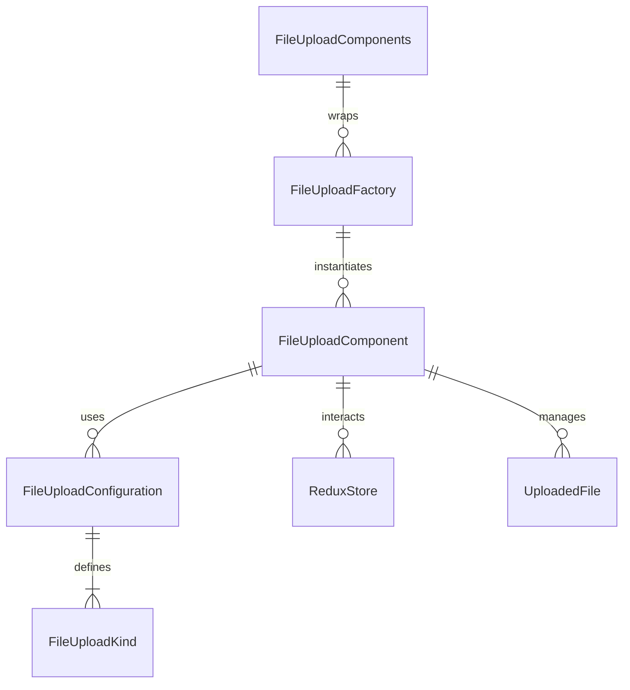

# FileUpload Component Folder Explanation

## Overview

The `FileUpload` folder implements a unified, configuration-driven file upload system for React applications. It supports a wide variety of upload scenarios (dropzone, image uploader, avatar uploader, document uploader, gallery, bulk, etc.) using a single, DRY component and factory pattern. The system is designed for flexibility, extensibility, and visual consistency, with support for custom validation, preview, drag-and-drop, and Redux state management.

## Key Files

- **FileUpload.tsx**: The main FileUpload component. Renders all file upload types based on the `kind` prop and configuration. Handles drag-and-drop, file selection, validation, preview, progress, and error states. Integrates with Redux for per-instance state management.
- **configurations.ts**: Centralizes all file upload configuration presets. Defines the `FileUploadKind` type, configuration interfaces, and a map of default configurations for each kind. Provides utility functions for validation, formatting, and style resolution.
- **factory.ts**: Provides the `FileUploadFactory` class and `FileUploadComponents` for DRY instantiation of file uploaders. Enables rapid creation of common upload patterns and custom uploaders.
- **FileUpload.module.scss**: Contains all styles for the file upload component, including layout, variants, drag-and-drop, preview, progress, and responsive design. Uses SCSS modules and project-wide mixins/variables.
- **index.ts**: Barrel file that exports the main component, types, configurations, factory, and pre-configured components for easy import elsewhere.

## Usage Patterns

- **Direct Usage**: Use `<FileUpload kind="dropzone" ... />` for a dropzone, `<FileUpload kind="image-uploader" ... />` for an image uploader, or override content/actions as needed.
- **Factory/Pre-configured Components**: Use `FileUploadFactory` or `FileUploadComponents` for DRY, configuration-driven instantiation of common file upload UIs.
- **Redux Integration**: Each file upload instance manages its own state in Redux, supporting multiple uploaders on the same page.

## Extensibility

- Add new file upload kinds or variants by updating `configurations.ts`.
- Add new pre-configured components in `factory.ts` for common use cases.
- Customize styles in `FileUpload.module.scss`.

## ERD (Entity Relationship Diagram)

**Legend:**

- `FileUploadComponent`: The main FileUpload React component (`FileUpload.tsx`)
- `FileUploadConfiguration`: Configuration object for a file upload kind
- `FileUploadKind`: Enum/type for file upload UI variants
- `FileUploadFactory`: Factory class for DRY instantiation
- `FileUploadComponents`: Pre-configured factory components
- `ReduxStore`: Redux state for per-instance upload state
- `UploadedFile`: File objects managed by the component

## Function-by-Function Reference

### FileUpload.tsx

- **FileUpload (component)**: Main file upload component. Handles drag-and-drop, file selection, validation, preview, progress, and error states. Integrates with Redux for per-instance state management and supports all configuration-driven variants.
- **handleFiles**: Handles file selection or drop, validates files, updates Redux state, and triggers callbacks for selection, progress, completion, and errors.
- **handleFileInput**: Handles file input change events and delegates to `handleFiles`.
- **handleDrop**: Handles file drop events, updates drag state, and processes dropped files.
- **handleDragOver**: Handles drag over events and updates drag state.
- **handleDragLeave**: Handles drag leave events and updates drag state.
- **handleClick**: Handles click events to trigger the file input dialog.
- **getDisplayText**: Determines the display text based on upload state, progress, errors, and selected files.

### configurations.ts

- **FileUploadKind, FileUploadVariant, FileUploadSize, FileUploadState (types)**: Type definitions for file upload kinds, variants, sizes, and states.
- **FileUploadConfiguration, FileUploadStyling, FileUploadBehavior, FileUploadValidation, FileUploadDisplay (interfaces)**: Configuration interfaces for file uploaders.
- **FILE_UPLOAD_CONFIGURATIONS (object)**: Map of all file upload kinds to their configuration objects.
- **FILE_UPLOAD_GROUPS (object)**: Groups of file upload kinds for convenience.
- **getFileUploadConfig**: Returns the configuration object for a given file upload kind.
- **createFileUploadConfig**: Returns a configuration object for a given kind, with optional overrides.
- **validateFileUploadConfig**: Validates a file upload configuration object.
- **formatFileSize**: Formats a file size in bytes to a human-readable string.
- **getFileExtension**: Returns the file extension from a filename.
- **getMimeTypeFromExtension**: Returns the MIME type for a given file extension.
- **validateFile**: Validates a single file against a validation configuration.
- **generateFileId**: Generates a unique ID for a file.
- **createFilePreview**: Creates a preview URL for a file (usually an image).
- **getFileUploadStyles**: Returns the style configuration for a given kind, variant, and size.
- **validateFiles**: Validates an array of files against validation rules.

### factory.ts

- **FileUploadFactory (class)**: Provides static methods to create configured file upload components from configuration objects or by kind.
  - `create`: Returns a forwardRef-wrapped component with the given configuration and props.
  - `createFromKind`: Returns a forwardRef-wrapped component for a given kind using its configuration.
- **FileUploadComponents (object)**: Pre-configured file upload components for common scenarios (e.g., `Dropzone`, `ImageUploader`, `BulkUploader`, etc.).

### index.ts

- **Exports**: Re-exports the main `FileUpload` component, types, configuration utilities, factory, and pre-configured components for easy import.

## Summary

This folder provides a robust, unified, and extensible file upload UI system. All file upload UIs are driven by configuration, making it easy to add new features, maintain consistency, and avoid code duplication. The ERD above shows the relationships between the main entities in this system. The function-by-function reference describes the main exports and their responsibilities.
