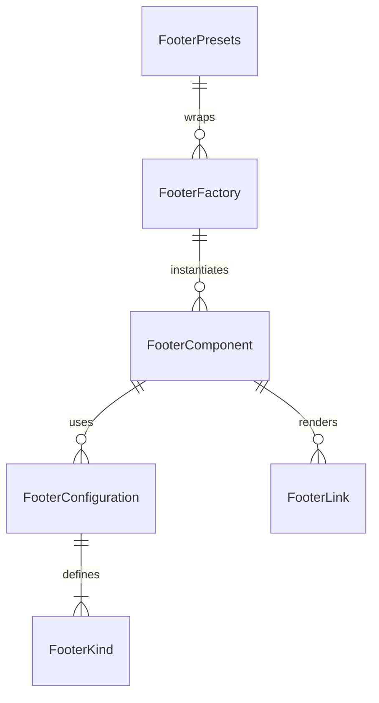

# Footer Component Folder Explanation

## Overview

The `Footer` folder implements a , configuration-driven footer system for React applications. It supports a wide variety of footer layouts (simple, standard, minimal, social, corporate, app, landing, sticky, custom) using a single, DRY component and factory pattern. The system is designed for flexibility, rapid development, and visual consistency, with support for custom content, links, themes, and responsive layouts.

## Key Files

- **Footer.tsx**: The main Footer component. Renders all footer types based on the `kind` prop and configuration. Handles layout, theming, stickiness, and custom content.
- **configurations.ts**: Centralizes all footer configuration presets. Defines the `FooterKind` type, configuration interfaces, and a map of default configurations for each kind. Used by the factory and main component.
- **factory.tsx**: Provides the `FooterFactory`, `FooterBodyFactory`, and `FooterPresets` for DRY instantiation of footers. Enables rapid creation of common patterns and custom footers.
- **Footer.module.scss**: Contains all styles for the footer component, including layout, variants, theming, stickiness, and responsive design. Uses SCSS modules and project-wide mixins/variables.
- **index.ts**: Barrel file that exports the main component, types, configurations, factory, and presets for easy import elsewhere.

## Usage Patterns

- **Direct Usage**: Use `<Footer kind="standard" ... />` for a standard footer, or override content/links as needed.
- **Factory/Presets**: Use `FooterFactory`, `Foot`, or `FooterPresets` for DRY, configuration-driven instantiation of common footer UIs.
- **Custom Content**: Pass children or use `leftContent`, `centerContent`, and `rightContent` for custom layouts.

## Extensibility

- Add new footer kinds or variants by updating `configurations.ts`.
- Add new presets in `factory.tsx` for common use cases.
- Customize styles in `Footer.module.scss`.

## ERD (Entity Relationship Diagram)

**Legend:**

- `FooterComponent`: The main Footer React component (`Footer.tsx`)
- `FooterConfiguration`: Configuration object for a footer kind
- `FooterKind`: Enum/type for footer UI variants
- `FooterFactory`: Factory class/component for DRY instantiation
- `FooterPresets`: Predefined factory presets
- `FooterLink`: Link objects rendered in the footer

## Function-by-Function Reference

### Footer.tsx

- **Footer (component)**: Main footer component. Merges configuration and props, builds CSS classes, and renders the appropriate footer layout or custom children.

### configurations.ts

- **FooterKind (type)**: Enum/type for all supported footer variants.
- **FooterLink (interface)**: Interface for footer link objects (label, href, onClick).
- **FooterConfiguration (interface)**: Interface for footer configuration objects (kind, content, links, theme, size, etc.).
- **FOOTER_CONFIGURATIONS (object)**: Map of all footer kinds to their configuration objects.

### factory.tsx

- **FooterBodyFactory (component)**: Renders the appropriate footer body layout based on the `kind` and content props. Supports custom content and all predefined layouts (simple, standard, minimal, social, corporate, app, landing, sticky, custom).
- **SimpleFooterBody, StandardFooterBody, MinimalFooterBody, SocialFooterBody, CorporateFooterBody, AppFooterBody, LandingFooterBody (components)**: Render the content for each footer kind, including copyright, links, and layout.
- **FooterFactory (component)**: Factory component for creating footers by kind and configuration.
- **FooterPresets (object)**: Predefined factory presets for common footer types (SIMPLE, STANDARD, MINIMAL, SOCIAL, CORPORATE, APP, LANDING, STICKY).
- **createFooter (function)**: Convenience function for creating a footer component by kind and configuration.

### index.ts

- **Exports**: Re-exports the main `Footer` component, types, configuration utilities, factory, and presets for easy import.

## Summary

This folder provides a robust, , and extensible footer UI system. All footer-related UIs are driven by configuration, making it easy to add new features, maintain consistency, and avoid code duplication. The ERD above shows the relationships between the main entities in this system. The function-by-function reference describes the main exports and their responsibilities.
