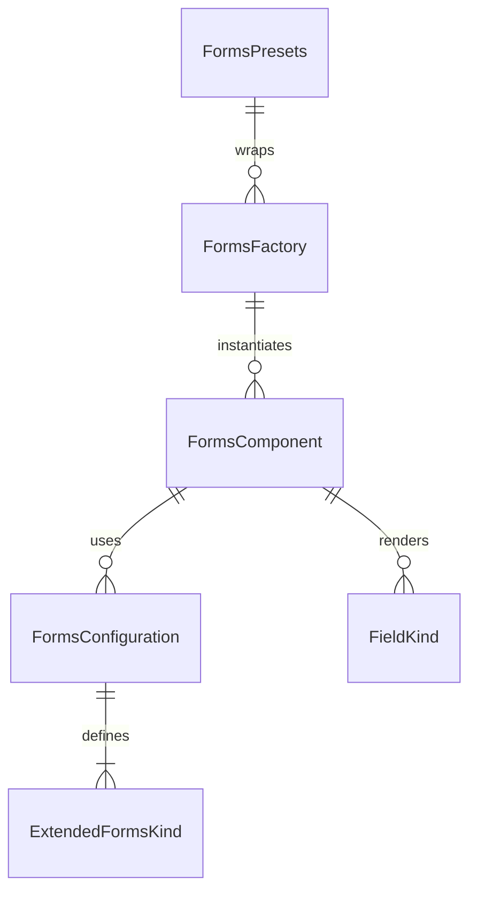

# Forms Component Folder Explanation

## Overview

The `Forms` folder implements a unified, configuration-driven form field system for React applications. It supports a wide variety of form field types (input, textarea, select, checkbox, radio, switch, range, and many specialized fields) using a single, DRY component and factory pattern. The system is designed for flexibility, rapid development, and visual consistency, with support for custom validation, error handling, and layout.

## Key Files

- **Forms.tsx**: The main Forms component. Renders all form field types based on the `kind` prop and configuration. Handles label, error, helper text, and full-width layout. Uses `FormsBodyFactory` for field rendering.
- **configurations.ts**: Centralizes all form field configuration presets. Defines the `ExtendedFormsKind` type, configuration interfaces, and a map of default configurations for each kind. Used by the factory and main component.
- **Forms.module.scss**: Contains all styles for the forms system, including layout, error states, label, helper text, and field-specific styles. Uses SCSS modules and project-wide mixins/variables.
- **index.ts**: Barrel file that exports the main component, types, configurations, factory, and presets for easy import elsewhere.

## Usage Patterns

- **Direct Usage**: Use `<Forms kind="input" ... />` for a text input, `<Forms kind="checkbox" ... />` for a checkbox, or override configuration as needed.
- **Factory/Presets**: Use `FormsFactory`, `F`, or `FormsPresets` for DRY, configuration-driven instantiation of common form fields and full forms.
- **Custom Configuration**: Pass `overrideConfig` to customize any field's configuration.

## Extensibility

- Add new form field kinds or variants by updating `configurations.ts`.
- Add new presets in `factory.tsx` for common use cases.
- Customize styles in `Forms.module.scss`.

## ERD (Entity Relationship Diagram)

**Legend:**

- `FormsComponent`: The main Forms React component (`Forms.tsx`)
- `FormsConfiguration`: Configuration object for a form field kind
- `ExtendedFormsKind`: Enum/type for form field UI variants
- `FormsFactory`: Factory class/component for DRY instantiation
- `FormsPresets`: Predefined factory presets for common forms
- `FieldKind`: Basic field type rendered by the component

## Function-by-Function Reference

### Forms.tsx

- **Forms (component)**: Main form field component. Handles label, error, helper text, full-width layout, and delegates field rendering to `FormsBodyFactory`.
- **FormsBodyFactory (component)**: Renders the appropriate field type (input, textarea, select, checkbox, radio, radio-group, switch, range) based on the `kind` and configuration. Handles value changes and event mapping for each field type.

### configurations.ts

- **ExtendedFormsKind (type)**: Enum/type for all supported form field variants.
- **FormsConfiguration (interface)**: Interface for form field configuration objects.

### factory.tsx

- **FormsFactory (component)**: Factory component for creating form fields by kind and configuration. Merges configuration and props, maps extended kinds to field kinds, and renders the correct field.
- **FormsPresets (object)**: Predefined form field and form layout presets for common scenarios (loginForm, signupForm, contactForm, addressForm, paymentForm, profileForm, settingsForm). Each preset returns an array of configured form fields.

### index.ts

- **Exports**: Re-exports the main `Forms` component, types, configuration utilities, factory, and presets for easy import.

## Summary

This folder provides a robust, unified, and extensible form field UI system. All form fields are driven by configuration, making it easy to add new features, maintain consistency, and avoid code duplication. The ERD above shows the relationships between the main entities in this system. The function-by-function reference describes the main exports and their responsibilities.
