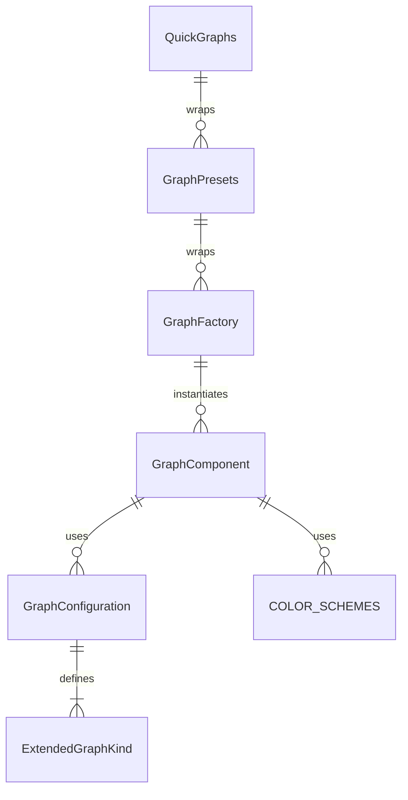

# Graphs Component Folder Explanation

## Overview

The `Graphs` folder implements a unified, configuration-driven graph/chart system for React applications. It supports a wide variety of graph types (bar, line, area, pie, doughnut, radar, scatter, composed, analytics, dashboard, stats, and more) using a single, DRY component and factory pattern. The system is designed for flexibility, rapid development, and visual consistency, with support for custom color schemes, responsive layouts, and advanced configuration.

## Key Files

- **Graphs.tsx**: The main Graph component. Renders all graph types based on the `kind` prop and configuration. Handles chart rendering using Recharts, color schemes, accessibility, and responsive design.
- **configurations.ts**: Centralizes all graph configuration presets. Defines the `ExtendedGraphKind` type, configuration interfaces, color schemes, and a map of default configurations for each kind. Used by the factory and main component.
- **Graphs.module.scss**: Contains all styles for the graphs system, including layout, chart-specific styles, color themes, and responsive design. Uses SCSS modules and project-wide mixins/variables.
- **index.ts**: Barrel file that exports the main component, types, configurations, factory, and presets for easy import elsewhere.

## Usage Patterns

- **Direct Usage**: Use `<Graph kind="bar" data={...} />` for a bar chart, `<Graph kind="pie" data={...} />` for a pie chart, or override configuration as needed.
- **Factory/Presets**: Use `GraphFactory`, `G`, `GraphPresets`, or `QuickGraphs` for DRY, configuration-driven instantiation of common graph types and analytics widgets.
- **Custom Configuration**: Pass custom configuration or color schemes for advanced use cases.

## Extensibility

- Add new graph kinds or variants by updating `configurations.ts`.
- Add new presets in `factory.tsx` for common use cases.
- Customize styles in `Graphs.module.scss`.

## ERD (Entity Relationship Diagram)

**Legend:**

- `GraphComponent`: The main Graph React component (`Graphs.tsx`)
- `GraphConfiguration`: Configuration object for a graph kind
- `ExtendedGraphKind`: Enum/type for graph/chart UI variants
- `GraphFactory`: Factory class/component for DRY instantiation
- `GraphPresets`: Predefined factory presets for analytics/dashboard widgets
- `QuickGraphs`: Ultra-convenient graph creation helpers
- `COLOR_SCHEMES`: Color palette objects used by the component

## Function-by-Function Reference

### Graphs.tsx

- **Graphs (component)**: Wrapper component that maps legacy `shape` to `kind` and renders the main `Graph` component.
- **Graph (component)**: Main graph/chart component. Handles all supported graph types, rendering the correct Recharts chart based on `kind` and configuration. Supports color schemes, accessibility, and responsive design.

### configurations.ts

- **GraphVariant, GraphShape, ExtendedGraphKind (types)**: Enum/types for supported graph/chart variants and shapes.
- **GraphConfiguration, DataPointConfiguration, AxisConfiguration, LegendConfiguration, TooltipConfiguration, AnimationConfiguration (interfaces)**: Configuration interfaces for graphs and their subcomponents.
- **COLOR_SCHEMES (object)**: Predefined color palette objects for use in charts.

### factory.tsx

- **GraphFactory (class)**: Provides static methods for creating graphs by kind and data, with optional configuration overrides. Includes shortcuts for common chart types (bar, line, area, pie, radar, scatter, composed, analytics, dashboard, stats, etc.).
  - `create`: Returns a graph component for a given kind and data.
  - `withConfig`: Returns a graph with a custom configuration.
  - `createMultiple`: Returns an array of graphs for multiple configs.
  - Chart type shortcuts: `bar`, `horizontalBar`, `stackedBar`, `line`, `smoothLine`, `multiLine`, `area`, `stackedArea`, `pie`, `doughnut`, `radar`, `scatter`, `composed`.
  - Analytics shortcuts: `analyticsTrend`, `analyticsComparison`, `analyticsDistribution`, `analyticsPerformance`.
  - Dashboard shortcuts: `dashboardSummary`, `dashboardKpi`, `dashboardTrend`, `dashboardMini`.
  - Stats shortcuts: `statsScoreProgression`, `statsPerformanceRadar`, `statsMatchHistory`, `statsCategoryBreakdown`, `statsTimeSeries`.
- **GraphPresets (object)**: Predefined graph/analytics/dashboard widget presets for common scenarios (TREND, COMPARISON, DISTRIBUTION, PERFORMANCE, KPI, MINI_TREND, SUMMARY, SCORE_HISTORY, PERFORMANCE_BREAKDOWN, MATCH_HISTORY, CATEGORY_STATS, MOBILE, COMPACT, FULL).
- **QuickGraphs (object)**: Ultra-convenient graph creation helpers for direct data visualization and dashboard widgets.

### index.ts

- **Exports**: Re-exports the main `Graph` component, types, configuration utilities, factory, and presets for easy import.

## Summary

This folder provides a robust, unified, and extensible graph/chart UI system. All graph UIs are driven by configuration, making it easy to add new features, maintain consistency, and avoid code duplication. The ERD above shows the relationships between the main entities in this system. The function-by-function reference describes the main exports and their responsibilities.
