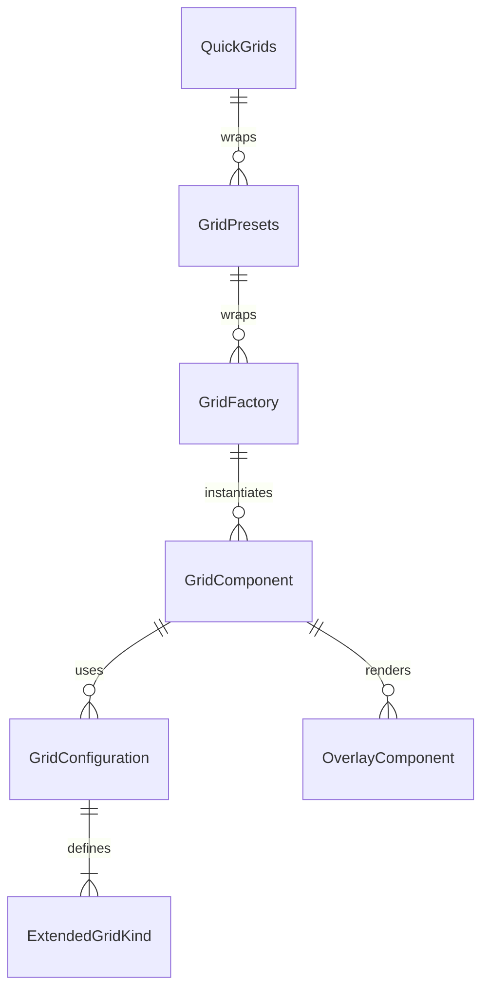

# Grid Component Folder Explanation

## Overview

The `Grid` folder implements a , configuration-driven grid system for React applications. It supports a wide variety of grid types (basic, game, preview, locked, VS mode, pregame lockout, solved groups, word grid, and custom) using a single, DRY component and factory pattern. The system is designed for flexibility, rapid development, and visual consistency, with support for custom layouts, behaviors, overlays, and responsive design.

## Key Files

- **Grid.tsx**: The main Grid component. Renders all grid types based on the `kind` prop and configuration. Handles layout, interactivity, VS mode overlays, solved groups, pregame lockout, and custom cell rendering.
- **configurations.ts**: Centralizes all grid configuration presets. Defines the `ExtendedGridKind` type, configuration interfaces, and a map of default configurations for each kind. Provides helper functions for creating and validating grid configurations.
- **Grid.module.scss**: Contains all styles for the grid system, including layout, variants, cell states, overlays, solved groups, and responsive design. Uses SCSS modules and project-wide mixins/variables.
- **index.tsx**: Barrel file that exports the main component, types, configurations, factory, and presets for easy import elsewhere. Also provides a legacy-compatible `VSGrid` export.

## Usage Patterns

- **Direct Usage**: Use `<Grid kind="game" words={...} onSelect={...} />` for a game grid, `<Grid kind="vs-grid" ... />` for VS mode, or override configuration as needed.
- **Factory/Presets**: Use `GridFactory`, `G`, `GridPresets`, or `QuickGrids` for DRY, configuration-driven instantiation of common grid types and game layouts.
- **Custom Configuration**: Pass `overrideConfig` to customize any grid's configuration.

## Extensibility

- Add new grid kinds or variants by updating `configurations.ts`.
- Add new presets in `factory.tsx` for common use cases.
- Customize styles in `Grid.module.scss`.

## ERD (Entity Relationship Diagram)

**Legend:**

- `GridComponent`: The main Grid React component (`Grid.tsx`)
- `GridConfiguration`: Configuration object for a grid kind
- `ExtendedGridKind`: Enum/type for grid UI variants
- `GridFactory`: Factory class/component for DRY instantiation
- `GridPresets`: Predefined factory presets for game layouts
- `QuickGrids`: Ultra-convenient grid creation helpers
- `OverlayComponent`: Overlay/VS mode components rendered by the grid

## Function-by-Function Reference

### configurations.ts

- **GridVariant, ExtendedGridKind**: Type definitions for grid variants and kinds.
- **GridLayout, GridStyling, GridBehavior, GridConfiguration**: Interfaces describing the structure of grid configuration objects.
- **GRID_CONFIGURATIONS**: A record mapping each `ExtendedGridKind` to its default `GridConfiguration` object.
- **GRID_GROUPS**: Categorizes grid kinds for easier grouping (basic, VS mode, special, custom).
- **GRID_PRESETS**: Commonly used grid presets for standard game, VS match, preview, and locked pregame grids.
- **createGridConfig(baseKind, overrides)**: Returns a new grid configuration by merging the base configuration for `baseKind` with any `overrides` provided.
- **validateGrid(config)**: Returns `true` if the given grid configuration is valid (has a variant, layout, and positive row/col counts), otherwise `false`.

### factory.tsx

- **GridFactory(props)**: React functional component. Instantiates a `Grid` of the specified kind, optionally merging in `overrideConfig`.
- **GridFactoryClass**: Class with static methods for creating grids:
  - `create(kind, props)`: Returns a `Grid` of the given kind and props.
  - `game(props)`: Returns a game grid.
  - `pregameLockout(props)`: Returns a pregame lockout grid.
  - `solvedGroups(props)`: Returns a solved groups display grid.
  - `preview(props)`: Returns a preview grid.
- **GridPresets**: Object with React components for common grid layouts:
  - `GameGrid(props)`: Standard game grid.
  - `VSGrid(props)`: VS match grid.
  - `PreviewGrid(props)`: Preview grid.
  - `LockedGrid(props)`: Locked pregame grid.
- **QuickGrids**: Object with shortcut React components for rapid grid creation:
  - `Game({words, onSelect, selected})`: Basic game grid.
  - `VS({words, selected, opponentSelected, onSelect, playerId, opponentId})`: VS mode grid.
  - `Bot({words, selected, onSelect, botDifficulty, playerId})`: Bot game grid.
  - `Preview({words})`: Non-interactive preview grid.
  - `SolvedGroups({pendingSolvedGroups, activePuzzle})`: Solved groups display.
  - `Lockout({gridWords, gridCols, gridRows})`: Pregame lockout grid.

### Grid.tsx

- **Grid (main component)**: Renders a grid of the specified kind, using configuration-driven rendering. Handles layout, interactivity, overlays, solved groups, pregame lockout, and custom cell rendering.
- **renderSolvedGroups(pendingSolvedGroups, activePuzzle, gridClasses, props, ref)**: Helper function. Renders the solved groups display for the `solved` kind.
- **renderPregameLockout(words, layout, gridClasses, props, ref)**: Helper function. Renders the pregame lockout grid with locked cells.
- **renderVSOverlays(isVSMode, isOpponent, solvedByPlayer, playerId, opponentId, playerColor, opponentColor, botDifficulty, isPreview)**: Helper function. Renders overlays for VS mode, such as opponent selection and solved badges.

### index.tsx

- **Exports**: Re-exports all main types, components, configurations, factories, and presets for easy import.
- **VSGrid (legacy wrapper)**: Deprecated component for backward compatibility. Renders a VS grid and logs a deprecation warning.

## Summary

This folder provides a robust, , and extensible grid UI system. All grid UIs are driven by configuration, making it easy to add new features, maintain consistency, and avoid code duplication. The ERD above shows the relationships between the main entities in this system. The function-by-function reference describes the main exports and their responsibilities.
