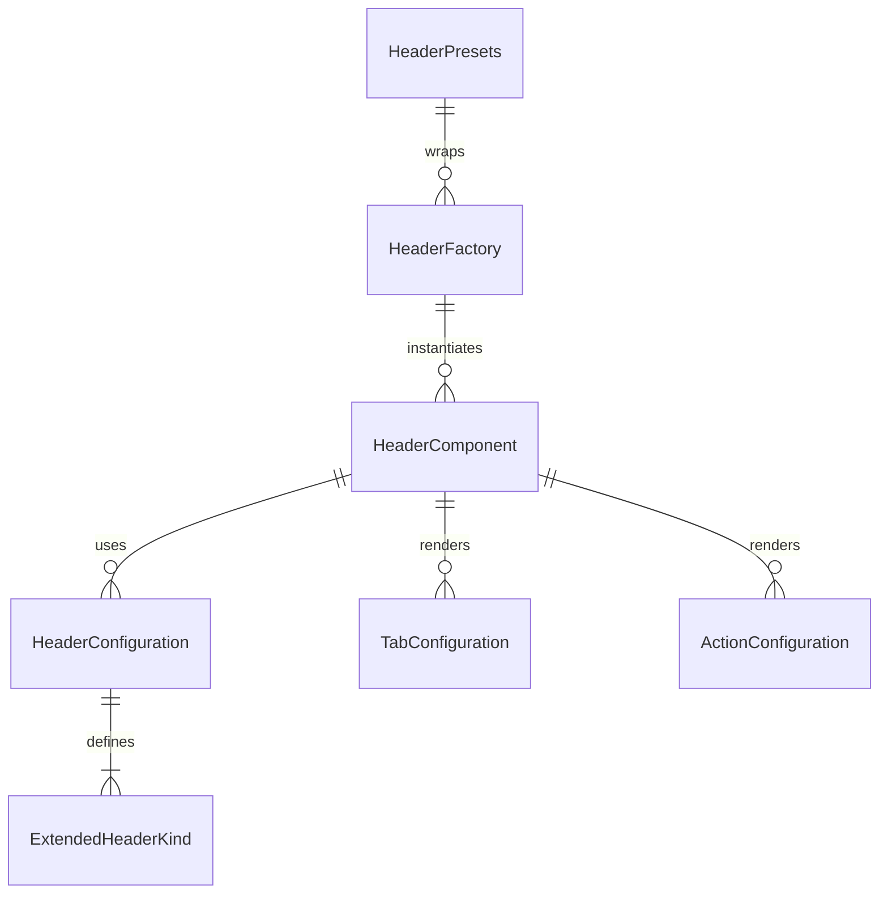

# Header Component Folder Explanation

## Overview

The `Header` folder implements a unified, configuration-driven header system for React applications. It supports a wide variety of header types (browse, dashboard, modal, page, sidebar, navigation, simple, custom, and more) using a single, DRY component and factory pattern. The system is designed for flexibility, rapid development, and visual consistency, with support for custom layouts, tabs, actions, theming, and responsive design.

## Key Files

- **Header.tsx**: The main Header component. Renders all header types based on the `kind` prop and configuration. Handles layout, title, tabs, actions, sticky/collapsible behavior, and custom content.
- **configurations.ts**: Centralizes all header configuration presets. Defines the `ExtendedHeaderKind` type, configuration interfaces, and a map of default configurations for each kind. Provides helper functions for creating and merging header configurations and actions.
- **Header.module.scss**: Contains all styles for the header system, including layout, variants, tabs, actions, sticky/collapsible behavior, and responsive design. Uses SCSS modules and project-wide mixins/variables.
- **index.tsx**: Barrel file that exports the main component, types, configurations, factory, and presets for easy import elsewhere. Also provides a legacy-compatible `BrowseHeader` export.

## Usage Patterns

- **Direct Usage**: Use `<Header kind="dashboard" title="Dashboard" ... />` for a dashboard header, `<Header kind="modal" ... />` for a modal header, or override configuration as needed.
- **Factory/Presets**: Use `HeaderFactory`, `H`, or `HeaderPresets` for DRY, configuration-driven instantiation of common header types and layouts.
- **Custom Configuration**: Pass `overrideConfig` to customize any header's configuration.

## Extensibility

- Add new header kinds or variants by updating `configurations.ts`.
- Add new presets in `factory.tsx` for common use cases.
- Customize styles in `Header.module.scss`.

## ERD (Entity Relationship Diagram)

**Legend:**

- `HeaderComponent`: The main Header React component (`Header.tsx`)
- `HeaderConfiguration`: Configuration object for a header kind
- `ExtendedHeaderKind`: Enum/type for header UI variants
- `HeaderFactory`: Factory class/component for DRY instantiation
- `HeaderPresets`: Predefined factory presets for common layouts
- `TabConfiguration`: Tab objects rendered in the header
- `ActionConfiguration`: Action button objects rendered in the header

## Function-by-Function Reference

### Header.tsx

- **Header (component)**: Main header component. Merges configuration and props, builds class names, and renders the appropriate header layout, including title, tabs, actions, and custom content.
- **renderActions**: Renders action buttons for left or right positions based on configuration.
- **renderTabs**: Renders tab navigation if enabled and tabs are provided.
- **renderTitle**: Renders the title and subtitle section if enabled.
- **renderContent**: Handles different header layouts and composes the header content.

### configurations.ts

- **HeaderVariant, ExtendedHeaderKind (types)**: Enum/types for supported header variants and kinds.
- **TabConfiguration, ActionConfiguration, HeaderConfiguration (interfaces)**: Configuration interfaces for tabs, actions, and headers.

### factory.tsx

- **HeaderFactory (class)**: Provides static methods for creating headers by kind and props, with configuration overrides and group creation. Includes quick creation methods for modal, browse, page, dashboard, and settings headers.
  - `create`: Returns a header component for a given kind and props.
  - `createGroup`: Returns a group of headers from a configuration object.
  - `getConfig`: Returns the configuration for a specific header kind.
  - `createWithOverrides`: Returns a header with custom configuration overrides.
  - Quick creation methods: `modal`, `browse`, `browseWithTabs`, `page`, `dashboard`.
- **HeaderPresets (object)**: Predefined header presets for common scenarios (modal, browse, page, dashboard, settings, game, profile, etc.).
- **createHeader (function)**: Utility function to create a header with the factory pattern.

### index.tsx

- **Exports**: Re-exports the main `Header` component, types, configuration utilities, factory, and presets for easy import. Also provides a legacy-compatible `BrowseHeader` export.
- **BrowseHeader (component)**: Legacy wrapper for browse-tabbed headers, converting legacy props to the new DRY system.

## Summary

This folder provides a robust, unified, and extensible header UI system. All header UIs are driven by configuration, making it easy to add new features, maintain consistency, and avoid code duplication. The ERD above shows the relationships between the main entities in this system. The function-by-function reference describes the main exports and their responsibilities.
