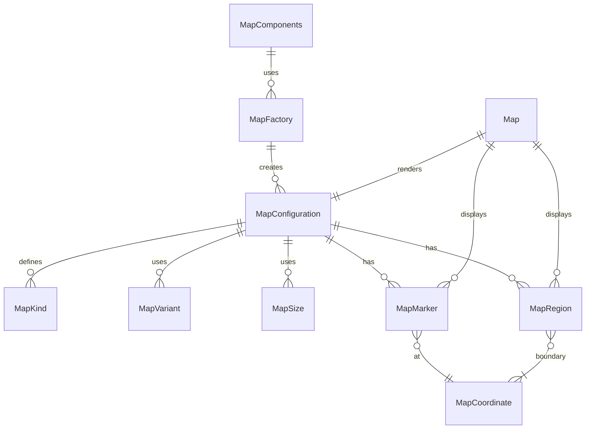

# Map Component Folder Explanation

## Overview

The `Map` component folder provides a unified, configuration-driven system for rendering a wide variety of map and geo-related UIs. It supports different map types (world, region, city, game, etc.), interactive features, markers, regions, and game-specific overlays. The system is designed to be DRY, extensible, and easy to use both directly and via factories.

### Key Files

- **Map.tsx**: The main React component. Handles rendering, configuration merging, Redux state management, and integration with Leaflet for map display and interaction.
- **configurations.ts**: Centralizes all map kinds, variants, sizes, and their configuration presets. Exports types and a lookup function for DRY configuration.
- **factory.ts**: Provides a `MapFactory` for creating pre-configured map components and a `MapComponents` object for easy access to common map types.
- **index.ts**: Barrel file for clean exports of all types, components, and factories.
- **Map.module.scss**: (Optional) SCSS module for styling the map and its overlays.

## Usage

- Use `<Map kind="world-map" ... />` for direct configuration, or use a prebuilt component from `MapComponents` (e.g., `<MapComponents.WorldMap />`).
- All map props can be overridden at usage time for flexibility.
- Markers, regions, and overlays are supported for interactive and game maps.

## Extensibility

- Add new map kinds or variants by updating `configurations.ts`.
- Add new prebuilt components by extending `MapComponents` in `factory.ts`.
- The system is designed to support both static and interactive/game maps.

## ERD (Entity Relationship Diagram)

## Function-by-Function Reference

### configurations.ts

- **MapKind, MapVariant, MapSize, MapCoordinate, MapMarker, MapRegion, MapConfiguration**: Type definitions and interfaces for map kinds, variants, sizes, coordinates, markers, regions, and configuration objects.
- **MAP_CONFIGURATIONS**: Record mapping each `MapKind` to its default `MapConfiguration` object.
- **getMapConfig(kind)**: Returns the configuration object for the given map kind.

### factory.ts

- **MapFactory**: Class with static methods for creating map components:
  - `create(config)`: Returns a React forwardRef component for a map with the given configuration and any additional props.
  - `createFromKind(kind)`: Looks up the configuration for the given kind and returns a forwardRef map component.
- **MapComponents**: Object containing pre-configured map components for each map kind (e.g., `WorldMap`, `RegionMap`, `GameMap`, etc.), each created using `MapFactory.createFromKind`.

### Map.tsx

- **Map (main component)**: React forwardRef component. Handles rendering of the map, configuration merging, Redux state management, and integration with Leaflet for map display and interaction.
- **getMarkerIcon(icon, color)**: Helper function. Returns a Leaflet DivIcon for a marker if the icon is a string or emoji.
- **getTileLayerUrl(variant)**: Helper function. Returns the appropriate tile layer URL for the given map variant.
- **handleZoomIn() / handleZoomOut()**: Functions to increase or decrease the map zoom, update Redux state, and call the `onZoomChange` callback.
- **renderZoomControls()**: Renders zoom in/out controls if enabled in the configuration.
- **renderMarkers()**: Renders all map markers as overlays.
- **renderGrid()**: Renders a grid overlay if enabled in the configuration.
- **renderCoordinates()**: Renders the current map coordinates if enabled.
- **renderScale()**: Renders a map scale overlay if enabled.
- **renderCompass()**: Renders a compass overlay if enabled.
- **renderMinimap()**: Renders a minimap overlay if enabled.
- **MapClickHandler()**: Handles map click events and calls the `onClick` callback if interactive.

### index.ts

- **Exports**: Re-exports all main types, components, configurations, factories, and helpers for easy import.

## Summary

This folder provides a robust, unified map component system for all mapping and geo needs in the UI Kit. It is fully configuration-driven, supports a wide range of use cases, and is easy to extend and maintain.
