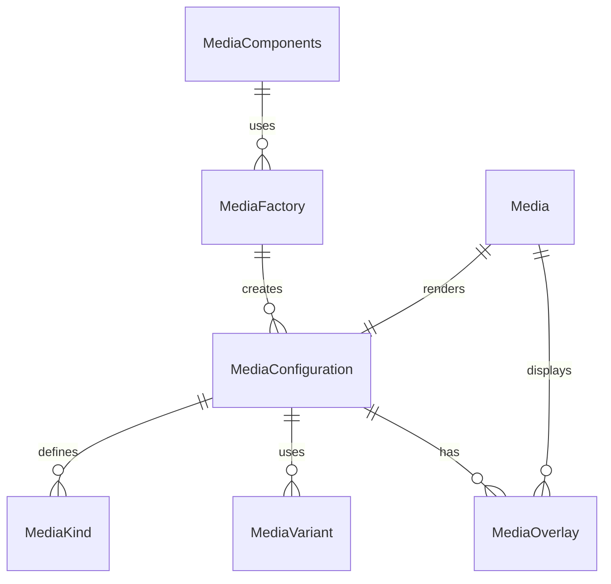

# Media Component Folder Explanation

## Overview

The `Media` component folder provides a , configuration-driven system for rendering and interacting with various media types, including images, videos, audio, and embeds. The system is designed to be DRY, extensible, and easy to use both directly and via factories.

### Key Files

- **Media.tsx**: The main React component. Handles rendering logic for different media types, responsive layouts, overlays, and controls.
- **configurations.ts**: Centralizes all media kinds, variants, and configuration presets. Exports types and a lookup function for DRY configuration.
- **index.ts**: Barrel file for clean exports of all types, components, and factories.
- **Media.module.scss**: (Optional) SCSS module for styling media containers, overlays, and controls.

## Usage

- All media props can be overridden at usage time for flexibility.
- Supports overlays, captions, and responsive layouts.

## Extensibility

- Add new media kinds or variants by updating `configurations.ts`.
- The system is designed to support both static and interactive media.

## ERD (Entity Relationship Diagram)

## Function-by-Function Reference

### configurations.ts

- **MediaKind, MediaSize, MediaShape, MediaVariant, MediaFit, MediaAction, MediaMetadata, MediaConfiguration**: Type definitions and interfaces for media kinds, sizes, shapes, variants, fit modes, actions, metadata, and configuration objects.
- **MEDIA_CONFIGURATIONS**: Record mapping each `MediaKind` to its default `MediaConfiguration` object.
- **getMediaConfig(kind)**: Returns the configuration object for the given media kind.

### factory.tsx

- **MediaFactory**: Class with static methods for creating media components:
  - `create(config)`: Returns a React forwardRef component for a media item with the given configuration and any additional props.
  - `createFromKind(kind)`: Looks up the configuration for the given kind and returns a forwardRef media component.

### Media.tsx

- **Media (main component)**: React forwardRef component. Handles rendering of the media item, configuration merging, Redux state management, and responsive layout.
- **handleImageLoad()**: Handles image load events, updates Redux state, and calls the `onLoad` callback.
- **handleImageError()**: Handles image error events, updates Redux state, and calls the `onError` callback.
- **handleClick()**: Handles click events if the media is clickable.
- **renderAvatar()**: Renders avatar-type media (user, system, bot, etc.).
- **renderImage()**: Renders image-type media.
- **renderVideo()**: Renders video-type media, including overlays and play/pause controls.
- **renderAudio()**: Renders audio-type media, including cover images and audio controls.
- **renderMediaContent()**: Determines which render function to use based on the media kind.
- **renderMetadata()**: Renders metadata (title, description, tags, etc.) if enabled.
- **renderActions()**: Renders action buttons if enabled and actions are provided.

### index.ts

- **Exports**: Re-exports all main types, components, configurations, factories, and helpers for easy import.

## Summary

This folder provides a robust, media component system for all image, video, audio, and embed needs in the UI Kit. It is fully configuration-driven, supports a wide range of use cases, and is easy to extend and maintain.
