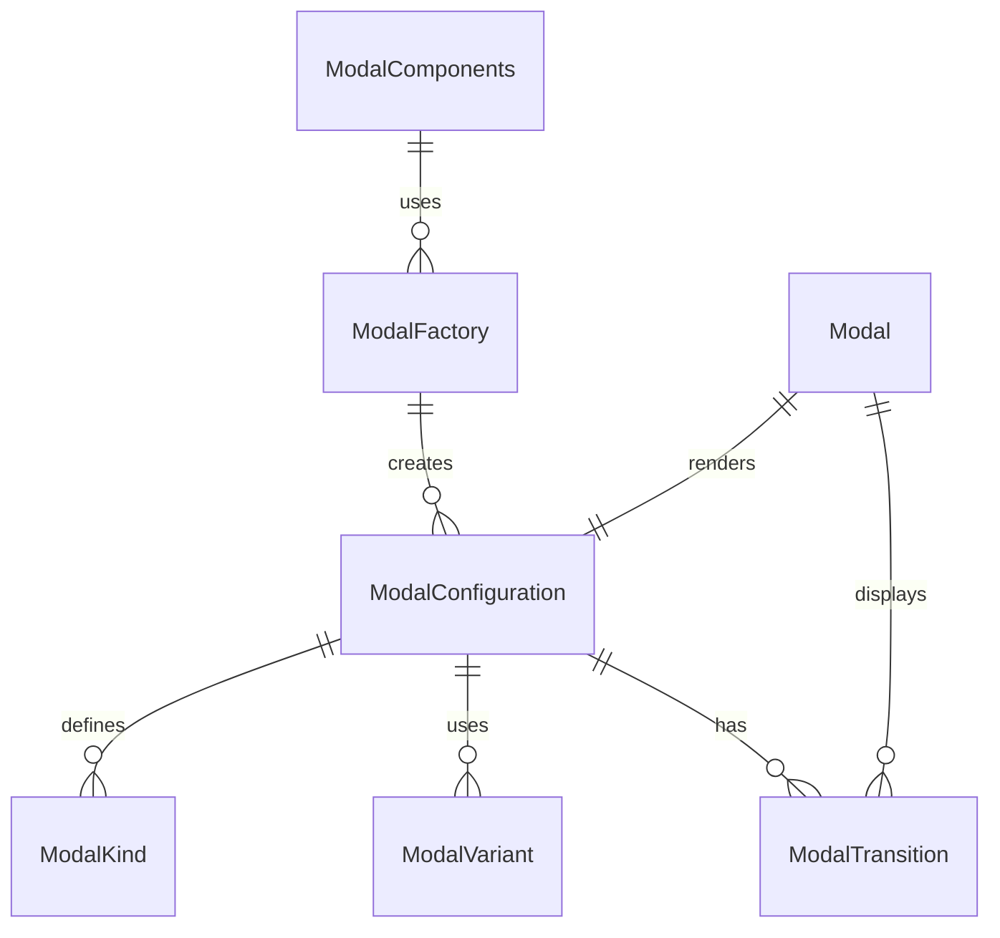

# Modal Component Folder Explanation

## Overview

The `Modal` component folder provides a , configuration-driven system for rendering modal dialogs, overlays, and popups. It supports a variety of modal types (alert, confirm, custom, fullscreen, etc.), transition effects, and accessibility features. The system is DRY, extensible, and easy to use both directly and via factories.

### Key Files

- **Modal.tsx**: The main React component. Handles rendering, configuration merging, focus management, keyboard accessibility, and transition effects.
- **configurations.ts**: Centralizes all modal kinds, variants, and configuration presets. Exports types and a lookup function for DRY configuration.
- **factory.tsx**: Provides a `ModalFactory` for creating pre-configured modal components and a `ModalComponents` object for easy access to common modal types.
- **index.ts**: Barrel file for clean exports of all types, components, and factories.
- **Modal.module.scss**: (Optional) SCSS module for styling modal containers, overlays, and transitions.

## Usage

- Use `<Modal kind="alert" ... />` for direct configuration, or use a prebuilt component from `ModalComponents` (e.g., `<ModalComponents.Alert />`).
- All modal props can be overridden at usage time for flexibility.
- Supports custom content, actions, and transition effects.

## Extensibility

- Add new modal kinds or variants by updating `configurations.ts`.
- Add new prebuilt components by extending `ModalComponents` in `factory.tsx`.
- The system is designed to support both simple and complex modal dialogs.

## ERD (Entity Relationship Diagram)

## Function-by-Function Reference

### configurations.ts

- **ExtendedModalKind, ModalSize, ModalPosition, ModalAnimation, ModalConfiguration**: Type definitions and interfaces for modal kinds, sizes, positions, animations, and configuration objects.
- **MODAL_CONFIGURATIONS**: Record mapping each `ExtendedModalKind` to its default `ModalConfiguration` object.
- **getModalConfiguration(kind)**: Returns the configuration object for the given modal kind.
- **mergeModalConfiguration(kind, overrides)**: Returns a merged configuration object by combining the default config for the kind with any overrides.
- **MODAL_GROUPS**: Groups modal kinds for common use cases (gameFlow, commerce, versus, interactions, layouts).
- **isGameModal(kind)**: Returns true if the kind is a game flow modal.
- **isVersusModal(kind)**: Returns true if the kind is a versus modal.
- **isCommerceModal(kind)**: Returns true if the kind is a commerce modal.
- **isInteractionModal(kind)**: Returns true if the kind is an interaction modal.
- **isLayoutModal(kind)**: Returns true if the kind is a layout modal.

### factory.tsx

- **ModalFactory**: React functional component. Instantiates a `Modal` of the specified kind with any additional props.
- **ModalPresets**: Object containing preset modal components for common use cases (e.g., `Alert`, `Confirm`, `Form`, `PreGame`, `EndGame`, etc.), each rendering a modal of the corresponding kind.
- **createModal**: Object with quick create functions for common modal patterns (`alert`, `confirm`, `form`).
- **SimpleModalFactory**: Class with static methods for creating modals for common patterns (confirmation, alert, game, VS mode, commerce, form, custom, and quick presets like delete/save confirmation and alerts).
- **ModalWorkflows**: Object with builder functions for creating grouped modal flows (game flow, VS mode flow, commerce flow).
- **useModal**: React hook for managing modal state in components. Provides methods to open, close, check, and show confirmation/alert modals.

### Modal.tsx

- **Modal (main component)**: React functional component. Handles rendering, configuration merging, focus management, keyboard accessibility, and transition effects for all modal types.
- **renderHeader()**: Renders the modal header, including title and close button if enabled.
- **renderBody()**: Renders the modal body, including custom content or default message.
- **renderCustomModalBody()**: Renders custom modal body content for special modal kinds (end-game, statistics, purchase, vs-mode, vs-room, share-content, etc.).
- **renderFooter()**: Renders the modal footer, including action buttons if enabled.
- **renderFooterButtons()**: Renders the appropriate footer buttons based on modal kind.
- **handlePurchase()**: Handles purchase logic for purchase modals, including async state and error handling.
- **handleCreateRoom()**: Handles room creation logic for VS room modals.
- **handleJoinRoom()**: Handles room join logic for VS room modals.
- **useEffect (keyboard handling)**: Handles Escape key to close modal if enabled.
- **useEffect (body scroll prevention)**: Prevents background scroll when modal is open if enabled.

### index.ts

- **Exports**: Re-exports all main types, components, configurations, factories, and helpers for easy import.

## Summary

This folder provides a robust, modal component system for all dialog, overlay, and popup needs in the UI Kit. It is fully configuration-driven, supports a wide range of use cases, and is easy to extend and maintain.
