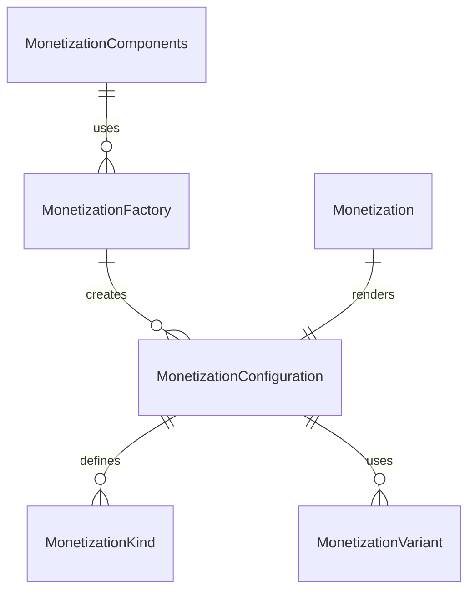

# Monetization Component Folder Explanation

## Overview

The `Monetization` component folder provides a unified, configuration-driven system for rendering monetization-related UI elements, such as paywalls, subscription prompts, purchase dialogs, and in-app currency displays. The system is DRY, extensible, and easy to use both directly and via factories.

### Key Files

- **Monetization.tsx**: The main React component. Handles rendering logic for different monetization types, user state, and integration with payment APIs or mock flows.
- **configurations.ts**: Centralizes all monetization kinds, variants, and configuration presets. Exports types and a lookup function for DRY configuration.
- **factory.tsx**: Provides a `MonetizationFactory` for creating pre-configured monetization components and a `MonetizationComponents` object for easy access to common monetization types.
- **index.ts**: Barrel file for clean exports of all types, components, and factories.
- **Monetization.module.scss**: (Optional) SCSS module for styling monetization UI elements.

## Usage

- Use `<Monetization kind="paywall" ... />` for direct configuration, or use a prebuilt component from `MonetizationComponents` (e.g., `<MonetizationComponents.Paywall />`).
- All monetization props can be overridden at usage time for flexibility.
- Supports custom content, actions, and integration with payment providers.

## Extensibility

- Add new monetization kinds or variants by updating `configurations.ts`.
- Add new prebuilt components by extending `MonetizationComponents` in `factory.tsx`.
- The system is designed to support both static and interactive monetization flows.

## ERD (Entity Relationship Diagram)

## Function-by-Function Reference

### configurations.ts

- **MonetizationKind, MonetizationVariant, MonetizationSize, PricingPeriod, PaymentMethod, MonetizationConfiguration, MonetizationStyling, MonetizationBehavior, MonetizationContent, PricingPlan, UsageData, PaymentData, and all component-specific config interfaces**: Type definitions and interfaces for monetization kinds, variants, sizes, pricing, payment, and configuration objects.
- **MONETIZATION_CONFIGURATIONS**: Record mapping each `MonetizationKind` to its default `MonetizationConfiguration` object.
- **MONETIZATION_GROUPS**: Groups monetization kinds for common use cases (pricing, payment, engagement, tracking).
- **createMonetizationConfig(kind, overrides?)**: Returns a merged configuration object for the given kind, applying any overrides.
- **validateMonetizationConfig(config)**: Returns true if the given config is valid for a monetization kind.
- **formatPrice(price, currency, period?)**: Formats a price as a currency string, optionally appending a period (e.g., per month).
- **calculateDiscount(originalPrice, discountedPrice)**: Returns the discount amount and percentage between two prices.

### factory.tsx

- **MonetizationFactory**: React functional component. Instantiates a `Monetization` of the specified kind, merging config and props.
- **MonetizationPresets**: Object containing preset creator functions for common monetization UI (e.g., `basicPlan`, `premiumPlan`, `usageTracker`, `checkoutForm`, `upgradeModal`, `creditBalance`, `buyButton`, `flashSale`).
- **createMonetization(kind, props)**: Simplified creator function for any monetization component.
- **SimpleMonetizationFactory**: Class with static methods for creating monetization components for all major use cases (pricing, payment, engagement, tracking, etc.).
- **QuickMonetization**: Object with quick React components for common monetization UI (e.g., `PricingCard`, `PremiumCard`, `UsageBar`, `PaymentForm`, `UpgradeModal`, `Credits`, `BuyButton`, `FlashSale`).

### Monetization.tsx

- **Monetization (main component)**: React forwardRef component. Handles rendering, configuration merging, and dynamic UI for all monetization kinds.
- **renderContent()**: Determines which monetization UI to render based on the `kind` prop.
- **renderPricingCard()**: Renders a pricing card for a single plan, including discount info and select button.
- **renderUsageMeter()**: Renders a usage meter with progress bar and upgrade option.
- **renderPaymentForm()**: Renders a payment form for checkout flows.
- **renderBillingSummary()**: Renders a billing summary with items, totals, and discounts.
- **renderFeatureComparison()**: Renders a feature comparison table for multiple plans.
- **renderSubscriptionPlan()**: Renders a grid of pricing cards for subscription plans.
- **renderUpgradePrompt()**: Renders an upgrade prompt with recommended plan and benefits.
- **renderCreditDisplay()**: Renders a credit balance display with purchase/earn actions.
- **renderPurchaseButton()**: Renders a purchase button for a product.
- **renderDiscountBanner()**: Renders a discount banner with code, expiry, and apply/dismiss actions.

### index.tsx

- **Exports**: Re-exports all main types, components, configurations, factories, and helpers for easy import.

## Summary

This folder provides a robust, unified monetization component system for all paywall, subscription, and purchase needs in the UI Kit. It is fully configuration-driven, supports a wide range of use cases, and is easy to extend and maintain.
