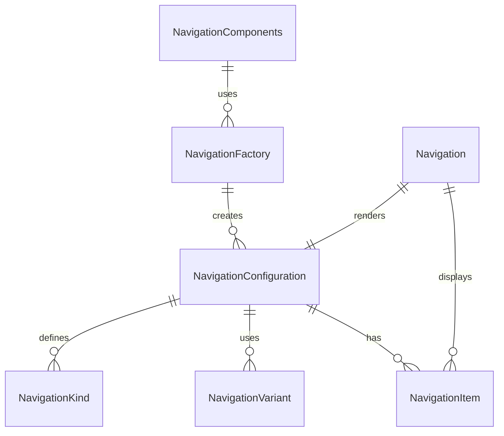

# Navigation Component Folder Explanation

## Overview

The `Navigation` component folder provides a unified, configuration-driven system for rendering navigation UIs, including navbars, sidebars, tab bars, breadcrumbs, and menus. The system is DRY, extensible, and easy to use both directly and via factories.

### Key Files

- **Navigation.tsx**: The main React component. Handles rendering logic for different navigation types, responsive layouts, and active state management.
- **configurations.ts**: Centralizes all navigation kinds, variants, and configuration presets. Exports types and a lookup function for DRY configuration.
- **factory.tsx**: Provides a `NavigationFactory` for creating pre-configured navigation components and a `NavigationComponents` object for easy access to common navigation types.
- **index.ts**: Barrel file for clean exports of all types, components, and factories.
- **Navigation.module.scss**: (Optional) SCSS module for styling navigation containers and items.

## Usage

- Use `<Navigation kind="navbar" ... />` for direct configuration, or use a prebuilt component from `NavigationComponents` (e.g., `<NavigationComponents.Navbar />`).
- All navigation props can be overridden at usage time for flexibility.
- Supports nested menus, icons, and responsive layouts.

## Extensibility

- Add new navigation kinds or variants by updating `configurations.ts`.
- Add new prebuilt components by extending `NavigationComponents` in `factory.tsx`.
- The system is designed to support both static and interactive navigation UIs.

## ERD (Entity Relationship Diagram)

## Function-by-Function Reference

### configurations.ts

- **NavigationKind, NavigationVariant, NavigationLayout, NavigationPosition, NavigationConfiguration, NavigationItem**: Type definitions and interfaces for navigation kinds, variants, layouts, positions, configuration objects, and navigation items.
- **NAVIGATION_CONFIGURATIONS**: Record mapping each `NavigationKind` to its default `NavigationConfiguration` object.
- **getNavigationConfig(kind)**: Returns the configuration object for the given navigation kind.
- **isNavigationKind(kind)**: Returns true if the given string is a valid navigation kind.
- **getNavigationsByVariant(variant)**: Returns all navigation configurations matching the given variant.
- **getNavigationsByLayout(layout)**: Returns all navigation configurations matching the given layout.
- **createNavigationConfig(baseKind, overrides)**: Returns a merged configuration object for the given base kind, applying any overrides.
- **NAVIGATION_PRESETS**: Object with preset configuration creators for common navigation use cases (e.g., `primaryApp`, `mobileApp`, `contentTabs`, `tablePagination`, `floatingNav`).
- **QUICK_NAVIGATION**: Object with quick builder functions for common navigation types (e.g., `navbar`, `tabs`, `breadcrumbs`, `pagination`).
- **generatePaginationItems(totalPages, currentPage)**: Helper function to generate navigation items for pagination controls.

### factory.ts

- **NavigationFactory(configOrKind)**: Factory function that returns a function to create a navigation component with the given config or kind.
- **N**: Ultra-short alias for `NavigationFactory`.
- **NavigationPresets**: Object containing pre-configured navigation component creators for all main navigation types and advanced presets (e.g., `navbar`, `mobileNav`, `dashboardNav`, `wizardNav`).

### Navigation.tsx

- **Navigation (main component)**: React forwardRef component. Handles rendering, configuration merging, and dynamic UI for all navigation kinds.
- **renderNavigationContent(config, items, ...)**: Determines which navigation UI to render based on the `kind` prop and configuration.
- **renderNavbar, renderMobileNav, renderHamburgerMenu, renderSideDrawer, renderBreadcrumbs, renderPagination, renderTabs, renderSegmentedControls, renderGenericNavigation**: Helper functions to render each navigation type (implementation unchanged for brevity).

### index.ts

- **Exports**: Re-exports all main types, components, configurations, factories, and helpers for easy import.

## Summary

This folder provides a robust, unified navigation component system for all navbar, sidebar, tab, and menu needs in the UI Kit. It is fully configuration-driven, supports a wide range of use cases, and is easy to extend and maintain.
