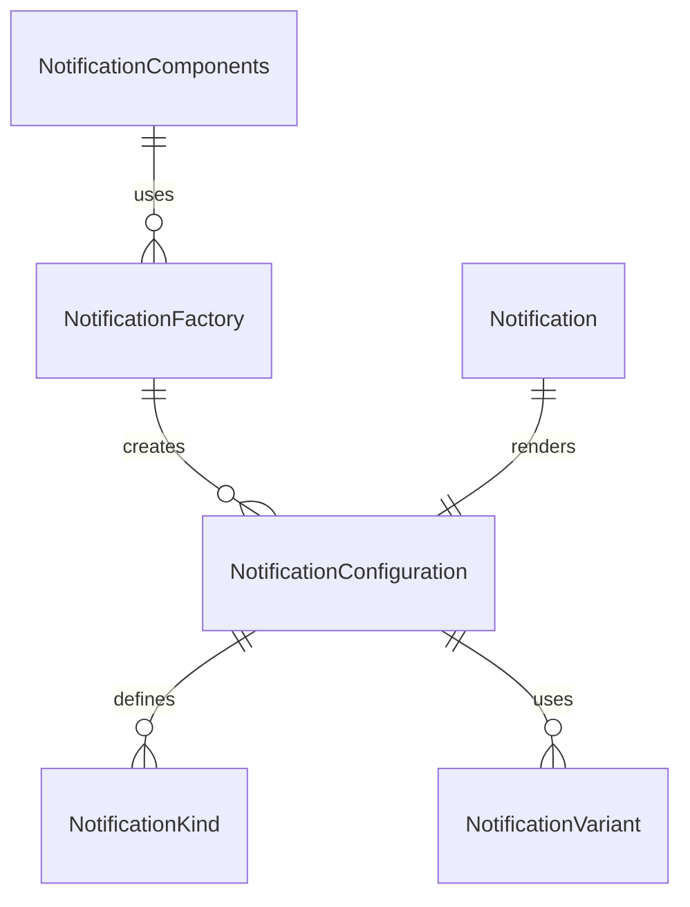

# Notification Component Folder Explanation

## Overview

The `Notification` component folder provides a unified, configuration-driven system for rendering notifications, alerts, toasts, and banners. It supports a variety of notification types (info, success, warning, error), positions, and auto-dismiss behaviors. The system is DRY, extensible, and easy to use both directly and via factories.

### Key Files

- **Notification.tsx**: The main React component. Handles rendering, configuration merging, animation, and auto-dismiss logic.
- **configurations.ts**: Centralizes all notification kinds, variants, and configuration presets. Exports types and a lookup function for DRY configuration.
- **factory.tsx**: Provides a `NotificationFactory` for creating pre-configured notification components and a `NotificationComponents` object for easy access to common notification types.
- **index.ts**: Barrel file for clean exports of all types, components, and factories.
- **Notification.module.scss**: (Optional) SCSS module for styling notification containers, animations, and icons.

## Usage

- Use `<Notification kind="success" ... />` for direct configuration, or use a prebuilt component from `NotificationComponents` (e.g., `<NotificationComponents.Success />`).
- All notification props can be overridden at usage time for flexibility.
- Supports custom content, actions, and auto-dismiss timers.

## Extensibility

- Add new notification kinds or variants by updating `configurations.ts`.
- Add new prebuilt components by extending `NotificationComponents` in `factory.tsx`.
- The system is designed to support both static and interactive notifications.

## ERD (Entity Relationship Diagram)

## Function-by-Function Reference

### Notification.tsx

- **Notification (component)**: Main React component for rendering notifications. Handles configuration merging, animation, auto-dismiss, progress bar, and action/callback logic. Uses local state for visibility and progress.
- **renderIcon**: Renders the notification icon based on severity or custom icon prop.
- **renderCloseButton**: Renders a close (dismiss) button if the notification is dismissible.
- **renderActions**: Renders action buttons or confirmation dialog actions, handling their callbacks.
- **renderProgressBar**: Renders a progress bar for auto-hide notifications.
- **handleHide**: Hides the notification and calls the `onHide` callback.
- **handleConfirm**: Handles confirmation action and hides the notification.
- **handleCancel**: Handles cancel action and hides the notification.
- **handleActionClick**: Handles custom action button clicks and optionally hides the notification.

### configurations.ts

- **NotificationKind, NotificationVariant, NotificationPosition, NotificationSeverity, NotificationAction (types)**: Type definitions for notification system.
- **NotificationConfiguration (interface)**: Interface for notification configuration objects.
- **NOTIFICATION_CONFIGURATIONS**: Registry of all built-in notification configurations by kind.
- **getNotificationConfig**: Returns the configuration object for a given notification kind.
- **mergeNotificationConfig**: Merges a base configuration with override values, returning a new configuration.
- **createNotificationConfig**: Creates a custom notification configuration by merging a kind's config with overrides.
- **validateNotificationConfig**: Validates a notification configuration, returning an array of error messages if invalid.
- **getDefaultIcon**: Returns a default icon string for a given notification severity.

### factory.ts

- **NotificationFactory**: Higher-order function that returns a pre-configured Notification component for a given kind or config.
- **NotificationPresets**: Object containing prebuilt notification component factories for all common notification kinds (e.g., `toastSuccess`, `alertError`).

### index.ts

- **NotificationProps (type)**: Exported type for Notification component props.
- **Notification**: Exported Notification component.
- **All configuration types and helpers**: Re-exported from `configurations.ts`.
- **NotificationFactory, NF, NotificationPresets**: Exported from `factory.ts`.

## Summary

This folder provides a robust, unified notification component system for all alert, toast, and banner needs in the UI Kit. It is fully configuration-driven, supports a wide range of use cases, and is easy to extend and maintain.
