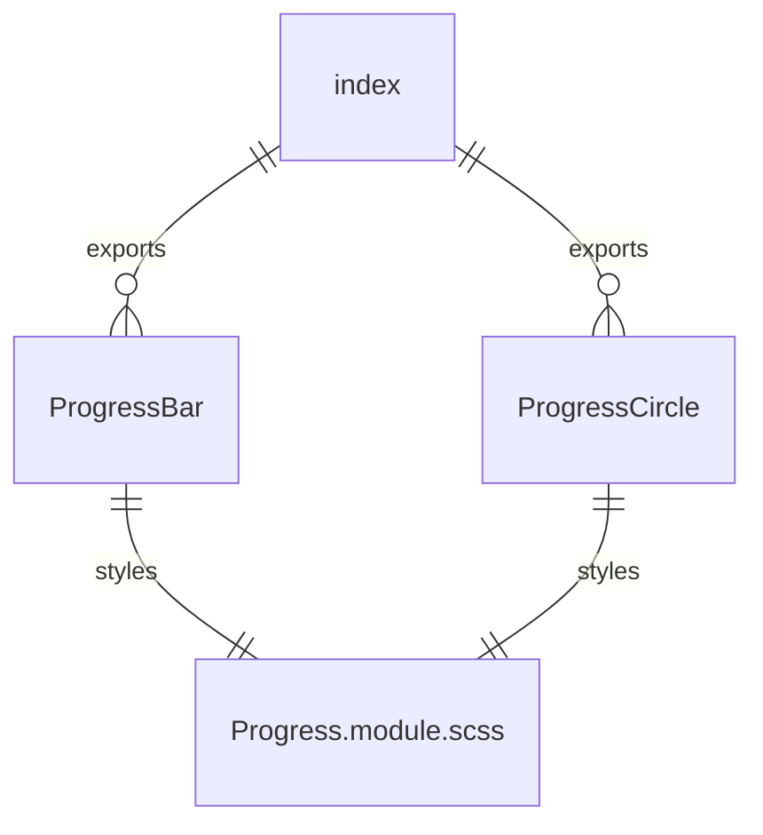

# Progress Component System

## Overview

The `Progress` folder implements a highly flexible, configuration-driven system for all types of progress indicators and loaders in the UI kit. It supports spinners, bars, skeletons, multi-step, upload/download, and more, all using a single, unified `Progress` component, a central configuration registry, and a factory for DRY creation. This system ensures consistency, extensibility, and rapid development of progress UIs.

## Key Files and Structure

- **Progress.tsx**: The main progress component. Handles all rendering logic for different progress types, merging configuration, props, and state.
- **configurations.ts**: Central registry of all progress kinds, variants, and configuration presets. Defines the configuration interface and utility functions.
- **factory.ts**: Provides the `ProgressFactory` and `ProgressComponents` for DRY, declarative progress creation. Includes utility for custom progress creation.
- **index.ts**: Barrel file for exports.
- **Progress.module.scss**: Styles for all progress variants, sizes, and animations.
- **Explanation.md**: (This file) Documentation and ERD for the Progress system.

## How It Works

- **Configuration-Driven**: All progress types and their default behaviors are defined in `configurations.ts`. This allows for easy extension and consistent usage.
- **Unified Component**: `Progress.tsx` merges configuration, props, and state. It supports all common progress features (indeterminate, striped, animated, multi-step, etc.) and custom content.
- **Factory Pattern**: The `ProgressFactory` and `ProgressComponents` allow for DRY, declarative progress creation in apps and UIs.
- **Customizability**: Utility functions allow for custom progress configurations and overrides, supporting both standard and unique indicators.

## Example Usage

```tsx
import { ProgressComponents } from './factory';

// Show a loading spinner
<ProgressComponents.LoadingSpinner />

// Show a linear progress bar with value
<ProgressComponents.LinearProgress value={60} label="Uploading..." />
```

## Entity Relationship Diagram (ERD)

```mermaid
erDiagram
    ProgressComponent ||--o{ ProgressConfiguration : uses
    ProgressComponent ||--o{ ProgressFactory : created_by
    ProgressFactory ||--o{ ProgressConfiguration : references
    ProgressComponent {
      string kind
      number value
      string label
      ...
    }
    ProgressConfiguration {
      string kind
      string variant
      string animation
      ...
    }
    ProgressFactory {
      create(config)
      createFromKind(kind)
      ProgressComponents
      ...
    }
```

## Extending the System

- Add new progress types or presets in `configurations.ts`.
- Use the factory or `ProgressComponents` for DRY progress creation.
- All rendering and animation logic is centralized in `Progress.tsx` and configuration.

---

This system ensures all progress indicators are consistent, easily configurable, and maintainable across the UI kit.

# Progress Component Folder Explanation

## Overview

The `Progress` component folder provides progress indicators for the UI Kit, such as linear progress bars and circular spinners. These components are used to visually represent loading, completion, or ongoing processes in the application. The system is designed to be DRY, customizable, and easy to integrate.

### Key Files

- **ProgressBar.tsx**: Main linear progress bar component. Handles value, animation, and color logic.
- **ProgressCircle.tsx**: Circular spinner or progress indicator. Handles SVG rendering and animation.
- **index.ts**: Barrel file for clean exports of all progress components.
- **Progress.module.scss**: SCSS module for styling progress bars and spinners.

## Usage

- Use `<ProgressBar value={50} />` for a linear progress bar.
- Use `<ProgressCircle />` for a circular spinner or determinate progress.
- All progress components accept props for color, size, and animation control.

## Extensibility

- Add new progress indicator types by creating new components and exporting them in `index.ts`.
- Customize styles via `Progress.module.scss`.

## ERD (Entity Relationship Diagram)



## Function-by-Function Reference

### ProgressBar.tsx

- **ProgressBar (component)**: Renders a linear progress bar. Handles value, min/max, color, and animation. Supports indeterminate and determinate modes.
- **getProgressColor**: Returns the color for the progress bar based on props or theme.
- **getProgressWidth**: Calculates the width percentage for the progress bar based on value, min, and max.

### ProgressCircle.tsx

- **ProgressCircle (component)**: Renders a circular SVG progress indicator. Handles value, size, stroke, and animation. Supports indeterminate and determinate modes.
- **getCircleProps**: Calculates SVG properties (radius, circumference, dasharray) for the circle based on size and value.

### index.ts

- **ProgressBar, ProgressCircle**: Exported progress indicator components.

## Summary

This folder provides flexible, DRY progress indicators for the UI Kit, supporting both linear and circular styles, with full customization and easy integration.
