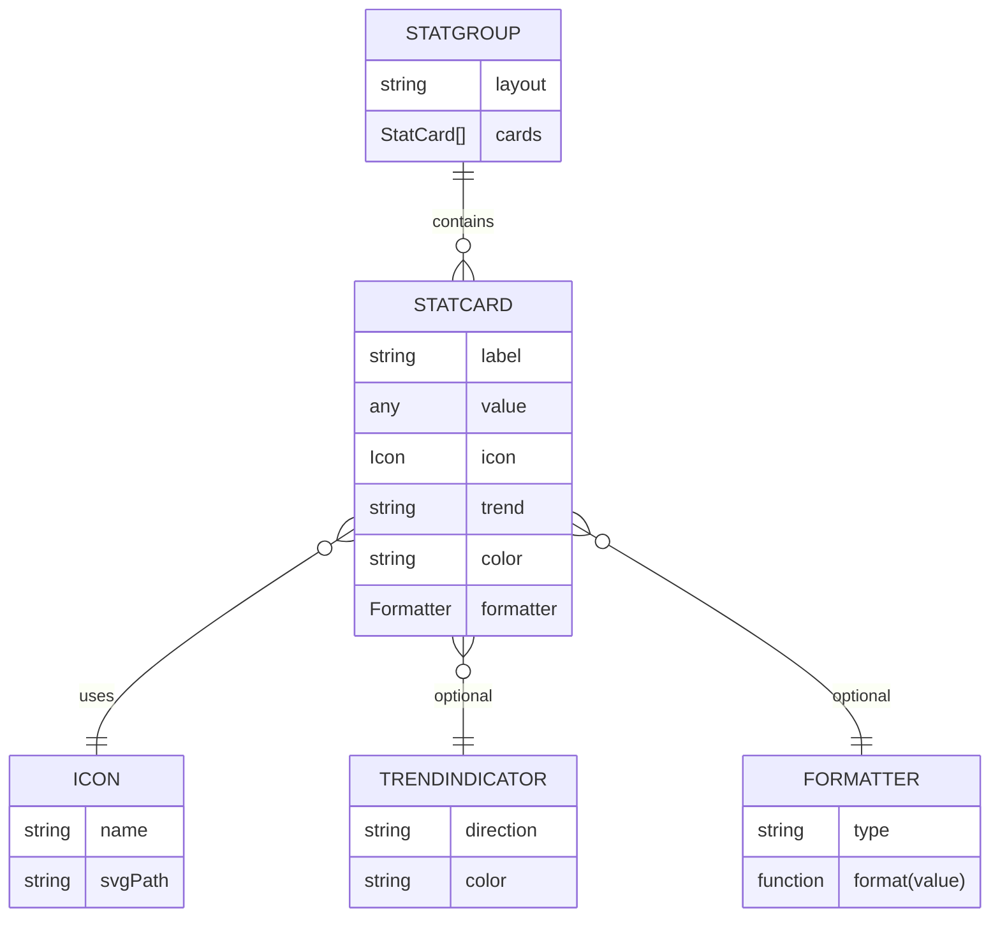

# Statistics Component Folder Explanation

The `Statistics` folder provides reusable, DRY components for displaying key metrics, stats, and summary data in a modern UI. These components are designed to be highly composable and customizable, supporting a variety of use cases such as dashboards, analytics panels, and summary cards.

## Key Concepts

- **Stat Cards**: Visual blocks that display a single metric, often with an icon, label, value, and optional trend indicator.
- **Stat Groups**: Collections of stat cards arranged in a grid or row for quick comparison.
- **Customization**: Supports custom icons, colors, and formatting for different types of statistics (e.g., currency, percentage, count).
- **Responsive Design**: Components adapt to different screen sizes and layouts.
- **Theming**: Integrates with the UI kit's theme system for consistent appearance.

## Typical Usage

- Displaying user stats (e.g., followers, posts, likes)
- Showing business KPIs (e.g., revenue, conversion rate)
- Visualizing analytics (e.g., active users, error rates)

## Example

```tsx
<StatGroup>
	<StatCard
		label='Users'
		value={1200}
		icon={<UserIcon />}
	/>
	<StatCard
		label='Revenue'
		value={'$4,500'}
		icon={<DollarIcon />}
		trend='up'
	/>
	<StatCard
		label='Errors'
		value={3}
		icon={<ErrorIcon />}
		trend='down'
	/>
</StatGroup>
```

## ERD (Entity Relationship Diagram)



## File Structure

- `StatCard.tsx` – Renders a single stat card.
- `StatGroup.tsx` – Arranges multiple stat cards in a group.
- `Statistics.module.scss` – Styles for statistics components.
- `Explanation.md` – This documentation file.

## Extensibility

- Add new stat types by extending the `StatCard` props.
- Integrate with analytics or data sources for live stats.
- Customize appearance via theming and SCSS variables.

## Function-by-Function Reference

### `Statistics` (default export)

A React functional component that displays a summary of player or global statistics. It supports multiple modes (`daily`, `vs`, `history`), customizable layouts, count-up animations, and optional features like trends, achievements, and comparisons. Main props include `stats`, `mode`, `kind`, `globalStats`, `opponentStats`, and various display and style options. Internally, it derives and formats stats for display, and renders them in a styled wrapper.

#### Key Internal Functions:

- `getStatsToShow()`: Returns an array of stat objects to display, based on the selected mode.
- `formatValue(value, format)`: Formats a value according to its type (number, percentage, time, date, etc).
- `formatDate(date)`: Formats a date string to a readable format using `date-fns`.
- `renderStatValue(value, format)`: Renders a stat value, optionally with a count-up animation.

---

### `StatisticsFactory` (default export from `factory.tsx`)

A class with static methods for creating statistics components in a DRY, declarative way. It provides methods to create single or grouped statistics components, as well as quick presets.

#### Methods:

- `create(kind, props)`: Returns a `Statistics` component of the given kind with provided props.
- `createGroup(groupName, sharedProps)`: Returns an array of `Statistics` components for a named group.
- `createQuick(quickName, props)`: Returns a `Statistics` component using a quick preset configuration.

---

### Shortcut and Preset Functions (from `factory.tsx`)

A set of exported functions for quickly creating statistics components for common use cases and layouts. Examples include:

- `Daily`, `VS`, `History`, `Summary`: Create statistics for daily, versus, history, or summary views.
- `DailyCard`, `VSCard`, `HistoryCard`, etc.: Create card-style statistics for each mode.
- `DashboardDaily`, `DashboardVS`, `DashboardHistory`: Preset dashboard statistics with common props.
- `ModalDaily`, `ModalVS`, `ModalHistory`: Preset modal statistics with expanded layouts.
- `MobileDaily`, `MobileVS`, `MobileHistory`: Mobile-optimized statistics presets.
- `AnimatedStats`, `StaticStats`, `HighlightedStats`: Utility functions for animated, static, or highlighted stats.
- `CardStats`, `GridStats`, `ListStats`, `TableStats`: Layout-specific shortcuts.
- `BlueStats`, `GreenStats`, `RedStats`, `PurpleStats`: Color scheme shortcuts.

---

### Types and Configurations (from `configurations.ts`)

- `StatisticsVariant`, `StatisticsDisplay`, `StatisticsLayout`: Type definitions for variants, display, and layout options.
- `PlayerStats`, `GlobalStats`: Interfaces for player and global statistics data.
- `StatisticsConfiguration`: Interface for configuration objects.
- `ExtendedStatisticsKind`: Union type for all supported statistics kinds.
- `STATISTICS_CONFIGURATIONS`: Preset configuration objects for each statistics kind.

---

### Barrel Exports (from `index.ts`)

- Re-exports the main `Statistics` component and related types for easy import elsewhere in the UI kit.

---

This reference covers all main exports, classes, and utilities in the `Statistics` folder, supporting rapid, DRY, and maintainable statistics UI development.

---

This folder follows the DRY/component system pattern: each component is focused, composable, and documented for rapid, maintainable UI development.
